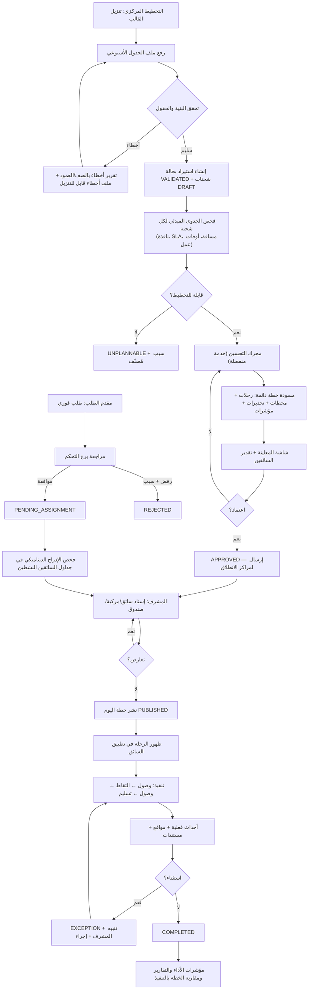

# المرحلة الأولى — تحليل المتطلبات
## نظام «مسار عينات» لتخطيط وتشغيل ومراقبة نقل العينات الطبية

**الإصدار:** 1.0 · **التاريخ:** 2026-08-26 · **الحالة:** معتمد للتنفيذ

---

## 1. نطاق النظام

«مسار عينات» منصة مركزية لإدارة دورة حياة نقل العينة الطبية من لحظة إدراجها في
الجدول الأسبوعي (أو إنشائها كطلب فوري) حتى تسليمها وتوثيق التسليم وإغلاق حالتها.
النظام **وطني متعدد المناطق**، وليس مصممًا لمدينة واحدة.

### داخل النطاق
تخطيط الرحلات وتحسينها، التحقق من صحة البيانات، إسناد الرحلات، تشغيل السائق،
التتبع اللحظي، مراقبة SLA والحرارة، الاستثناءات، التقارير، سجل التدقيق، وواجهة API.

### خارج النطاق (مرحلة لاحقة، مع نقاط توسعة جاهزة)
* التكامل الفعلي مع أنظمة المختبرات LIS/HIS (تُترك واجهة `LabSystemAdapter`).
* التكامل مع أجهزة حساسات الحرارة الفعلية (يُترك `TemperatureSensorAdapter` + بيئة محاكاة).
* إدارة الرواتب/الموارد البشرية للسائقين.
* الفوترة والمحاسبة (يُحسب تقدير تكلفة تشغيلي فقط).

---

## 2. الافتراضات المعلنة

كل افتراض هنا **قابل للتعديل من الإعدادات** ولا يُكتب داخل الكود.

| # | الافتراض | الأثر إن كان خاطئًا |
|---|---|---|
| A1 | العينة تُنقل من جهة التقاط واحدة إلى جهة تسليم واحدة (شحنة = زوج التقاط/تسليم). | لو وُجد تسليم جزئي لعدة جهات، يلزم تقسيم الشحنة إلى شحنات فرعية. |
| A2 | السائق يعمل وردية متصلة واحدة يوميًا (افتراضيًا ١٠ ساعات). | الورديات المقسّمة تحتاج نموذج `shift_segments`. |
| A3 | سعة المركبة ليست قيدًا حاكمًا لأن العينات صغيرة الحجم؛ القيد الحاكم هو الزمن. | إن ظهر قيد سعة، يُفعّل بُعد `capacity` الموجود أصلًا في المحرك (معطّل افتراضيًا). |
| A4 | زمن القيادة يأتي من خدمة طرق خارجية (OSRM/Google/HERE)؛ عند تعذرها يُستخدم تقدير هافرساين × معامل التفافية، **ويُعلَن ذلك صراحة في الخطة**. | نتائج تقديرية تظهر بوسم `ESTIMATED` ولا تُعتمد للنشر إلا بموافقة صريحة. |
| A5 | التوقيت التشغيلي هو `Asia/Riyadh`؛ التخزين بـ UTC (`timestamptz`) والعرض بالتوقيت المحلي للنطاق. | — |
| A6 | «الرحلة البعيدة» تُقاس بمسافة الطريق من مركز الانطلاق إلى أبعد نقطة في الرحلة (افتراضيًا ≥ ١٥٠ كم). | يمكن تغيير التعريف إلى «إجمالي مسافة الرحلة» من الإعدادات. |
| A7 | نافذة الالتقاط ±١٥ دقيقة حول الموعد المتفق عليه مع الجهة. | — |
| A8 | لا يُسمح بالوصول قبل بداية النافذة؛ الوصول المبكر يُترجم إلى **انتظار** يُحتسب ضمن الوردية. | — |
| A9 | بيانات العينات والمواقع وجهات الاتصال تُصنَّف **بيانات حساسة** بمفهوم نظام حماية البيانات الشخصية السعودي. | يفرض تشفيرًا، وتقييد وصول على مستوى السجل، وسجل تدقيق كامل. |
| A10 | كل جهة (مركز صحي/مستشفى/مختبر/بنك دم) لها إحداثيات دقيقة ومدة خدمة معرّفة. | الجهات ناقصة الإحداثيات تُرفض في التحقق ولا تدخل التخطيط. |

---

## 3. أصحاب المصلحة وحالات الاستخدام

### 3.1 مدير النظام `ADMIN`
| UC | حالة الاستخدام | مسار النجاح | مسارات الفشل |
|---|---|---|---|
| UC-A1 | إنشاء مستخدم وإسناد دور ونطاق | إنشاء → تعيين دور → تحديد نطاق (منطقة/مركز) → تفعيل | بريد مكرر · نطاق لا يطابق الدور |
| UC-A2 | تعريف مركز انطلاق جديد | منطقة → مدينة → إحداثيات → أوقات عمل → إعدادات القيود | إحداثيات خارج المملكة · تعارض أسماء |
| UC-A3 | تعديل قيمة قيد تشغيلي على نطاق محدد | اختيار النطاق → تعديل → سبب → حفظ | لا صلاحية · قيمة خارج المدى المسموح |
| UC-A4 | مراجعة سجل التدقيق | تصفية حسب المستخدم/العملية/الفترة | — |

### 3.2 التخطيط المركزي `CENTRAL_PLANNER`
| UC | حالة الاستخدام | مسار النجاح | مسارات الفشل |
|---|---|---|---|
| UC-P1 | رفع الجدول الأسبوعي | تنزيل قالب → رفع → مطابقة أعمدة → تحقق → مسودة | أخطاء صفوف · جهات غير مسجلة · تكرار |
| UC-P2 | تشغيل محرك التحسين | اختيار نطاق وأيام → تشغيل → معاينة | فشل خدمة الطرق · انتهاء مهلة الحل · طلبات غير قابلة للتخطيط |
| UC-P3 | مراجعة التحذيرات | فتح بطاقة → الانتقال للرحلة/الشحنة → قرار | — |
| UC-P4 | اعتماد الخطة وإرسالها للمراكز | اعتماد → توزيع على المراكز | وجود شحنات غير محسومة |
| UC-P5 | مراقبة تعديلات المشرفين | تقرير الفروقات خطة/تنفيذ + أسباب التعديل | — |
| UC-P6 | كشف الزيادة غير المبررة في السائقين | مقارنة المستخدم بالموصى به + تفسير الفارق | — |

### 3.3 مشرف مركز الانطلاق `HUB_SUPERVISOR`
| UC | حالة الاستخدام | مسار النجاح | مسارات الفشل |
|---|---|---|---|
| UC-S1 | إسناد رحلة لسائق | اختيار رحلة → سائق مرشح → فحص تعارض → إسناد | تعارض زمني · سائق غير متاح · مركبة مشغولة |
| UC-S2 | نشر خطة يوم واحد | اختيار اليوم → فحص جاهزية → نشر | رحلات بلا سائق |
| UC-S3 | معالجة طلب فوري | مراجعة → موافقة → فحص الإدراج في جدول سائق → إسناد | لا يوجد سائق يقبل الإدراج دون خرق قيد |
| UC-S4 | تعديل رحلة منشورة | تعديل → إلزام بكتابة السبب → إشعار السائق | خرق قيد صلب بعد التعديل |
| UC-S5 | معالجة حالة استثنائية | استلام تنبيه → تحديد الإجراء → إغلاق أو إعادة جدولة | — |

### 3.4 السائق `DRIVER`
| UC | حالة الاستخدام | مسار النجاح | مسارات الفشل |
|---|---|---|---|
| UC-D1 | بدء رحلة اليوم | فتح الرحلة (منشورة، تاريخها اليوم) → بدء | الرحلة غير منشورة · التاريخ لاحق |
| UC-D2 | تنفيذ محطة التقاط | وصلت → التقطت → رفع مستند | تسلسل حالات غير صحيح |
| UC-D3 | تنفيذ محطة تسليم | وصلت → سلّمت → رفع مستند | التسليم قبل الالتقاط |
| UC-D4 | تسجيل استثناء | اختيار سبب → إثبات → إرسال | — |
| UC-D5 | العمل دون اتصال ثم المزامنة | تخزين محلي → مزامنة عند العودة | تعارض أحداث → حل بقاعدة «أول حدث فعلي يفوز + مراجعة المشرف» |

### 3.5 مقدم الطلب الخارجي `EXTERNAL_REQUESTER`
| UC | حالة الاستخدام | مسار النجاح | مسارات الفشل |
|---|---|---|---|
| UC-E1 | إنشاء طلب فوري | تعبئة → إرسال → انتظار مراجعة | خارج أوقات العمل · جهة غير مفعّلة |
| UC-E2 | متابعة الطلب | عرض الحالة والزمن المتوقع | — |
| UC-E3 | إلغاء قبل الالتقاط | إلغاء → سبب → إشعار السائق | الالتقاط تم فعلًا ⇒ يُرفض الإلغاء |

---

## 4. مخطط تدفق العمليات

---

## 5. القيود الصلبة والمرنة

### 5.1 القيود الصلبة (خرقها ⇒ الطلب `UNPLANNABLE` مع سبب مسجّل)

| المعرّف | القيد | آلية التحقق |
|---|---|---|
| HC-01 | الالتقاط يسبق التسليم لنفس الشحنة | ترتيب المحطات + فحص لاحق `verify_precedence` |
| HC-02 | الالتزام بنافذة الالتقاط `[from, to]` | `arrival ≤ window_to` و `service_start ≥ window_from` |
| HC-03 | الالتزام بـ SLA التسليم | `delivery_time ≤ sla_deadline` |
| HC-04 | منع تضارب أحداث السائق نفسه | تسلسل زمني أحادي لكل رحلة + فحص تداخل بين رحلات السائق |
| HC-05 | عدم تجاوز مدة الوردية | `route_end − route_start ≤ max_shift` |
| HC-06 | السائق في مكان واحد في اللحظة الواحدة | نتيجة مباشرة لـ HC-04 |
| HC-07 | الرحلة تبدأ من مركز الانطلاق المحدد | عقدة البداية = الـ Hub |
| HC-08 | الرحلة تنتهي عند آخر تسليم | لا تُضاف عقدة عودة |
| HC-09 | العودة للمركز غير إلزامية | معطّلة افتراضيًا، قابلة للتفعيل بالإعداد |
| HC-10 | الرحلة الثانية تبدأ من موقع آخر تسليم أو الموقع الحالي | `chain_start_node` |
| HC-11 | التقاطان من نفس الجهة في اليوم ⇒ تسليم الأول قبل تنفيذ الثاني | قيد ترتيب مُولَّد `pickup₂ ≥ delivery₁` |
| HC-12 | يُسمح بتجميع عدة التقاطات قبل التسليم إن سمحت النوافذ وSLA | مسموح افتراضيًا (ليس قيدًا مانعًا) |
| HC-13 | منع خلط المستشفيات والمراكز الصحية على السائق نفسه | تلوين تجانس الرحلة `route_facility_class` |
| HC-14 | بنك الدم استثناء قابل للإعداد من HC-13 | قائمة `mixing_exempt_facility_types` |
| HC-15 | لا رحلتان بعيدتان لنفس السائق في اليوم | عدّاد `long_haul_count ≤ max_long_haul_per_day` |
| HC-16 | منع تنقلات المدينة غير المنطقية بعد رحلة بعيدة | `post_long_haul_policy` |
| HC-17 | الطلب الفوري بعد بدء السائق يُحسب من موقعه الحالي | `dynamic_insertion` من `current_position` |
| HC-18 | منع نشر طلب غير قابل للتنفيذ كطلب مخطط | بوابة `feasibility_gate` قبل `PUBLISHED` |
| HC-19 | تسجيل سبب عدم إمكانية التخطيط | `unplannable_reason` إلزامي |
| HC-20 | التحقق من توفر السائق والمركبة قبل الإسناد | فحص إجازات/صيانة/تعارض |

### 5.2 القيود المرنة (تدخل في دالة الهدف)

| المعرّف | القيد المرن | الرتبة |
|---|---|---|
| SC-01 | تقليل عدد السائقين والمركبات | 4 |
| SC-02 | تقليل زمن القيادة | 5 |
| SC-03 | تقليل المسافة | 6 |
| SC-04 | تقليل التكلفة | 7 |
| SC-05 | تقليل الانتظار غير الضروري | 8 |
| SC-06 | عدالة التوزيع | 9 |
| SC-07 | تقليل الانحراف عن الخطة المنشورة | 10 |

---

## 6. تعارضات في المتطلبات — موضّحة قبل اعتماد القرار

المطلوب في §34 «عند وجود تعارض في المتطلبات، وضّحه قبل اعتماد القرار». التالي ما رُصد:

| # | التعارض | القرار المعتمد |
|---|---|---|
| T-1 | §13 يحدد «فاصلًا ثابتًا بين الأحداث» (٢٠ د في عرعر، ١٠ د في المحافظات) بينما §13 نفسه يمنع الفواصل الثابتة في الرياض ويطلب زمن طريق حقيقي. | الفاصل الثابت يُطبَّق كـ **حد أدنى للفاصل** `min_event_gap` وليس بديلًا عن زمن الطريق. الزمن الفعلي = `max(زمن الطريق, الحد الأدنى للفاصل)`. القيمة قابلة للإعداد لكل نطاق، وتُضبط 0 في الرياض. **لم تُغيَّر القاعدة التشغيلية، بل فُسِّرت بما لا يُسقط أيًّا من النصّين.** |
| T-2 | §12/HC-13 يمنع خلط المستشفيات والمراكز الصحية، بينما §11 يطلب تقليل عدد السائقين. المنع يرفع عدد السائقين حتمًا. | HC-13 قيد **صلب** ويعلو على هدف تقليل السائقين. أثر القيد يُقاس ويُعرض صراحة في شاشة تقدير السائقين تحت بند «سائقون إضافيون بسبب قيد عدم الخلط»، ليكون قرار تخفيفه إداريًا لا برمجيًا. |
| T-3 | §12/HC-08 «الرحلة تنتهي عند آخر تسليم» مع HC-10 «الرحلة الثانية تبدأ من موقع آخر تسليم» ⇒ الوردية قد تتجاوز ١٠ ساعات إن احتُسب زمن العودة للمنزل/المركز. | مدة الوردية تُحتسب من بداية أول رحلة حتى **آخر تسليم**، ولا يُحتسب زمن العودة. إن أراد التشغيل احتسابه، يُفعّل `count_return_leg_in_shift` من الإعدادات. |
| T-4 | §7 «الطلبات الفورية لا تدخل التحسين الأسبوعي» مقابل «يجب فحص إمكانية إضافتها لجدول السائق دون خرق القيود». | التحسين الأسبوعي يبقى ثابتًا كـ **خطة مرجعية Baseline**؛ الطلب الفوري يُعالَج بمُحرِّك **إدراج ديناميكي** منفصل يعمل على نسخة حية من الجدول. تُحفظ النسختان للمقارنة (§17/§26). |
| T-5 | §18 «لا يُطلب من السائق إدخال الحرارة» مقابل §20 «قد لا يتوفر حساس حقيقي». | لا يوجد حقل حرارة في تطبيق السائق إطلاقًا. عند غياب الحساس، لا تُعرض حرارة (لا صفر ولا قيمة مُولَّدة) بل الحالة `NO_SENSOR` صراحةً. بيئة المحاكاة معزولة ولا تعمل إلا بعلم `MASAR_TEMPERATURE_SIMULATION=1` وتوسم كل قراءة بـ `source='SIMULATION'`. |
| T-6 | §12/HC-03 SLA صلب مقابل §19 «التسليم النهائي للعينة ضروري ولا تُحذف الشحنة». | عند تعذر التسليم لا تُلغى الشحنة: تبقى بحالة `EXCEPTION` مفتوحة مع `sla_breached=true`، ويُنشأ **التزام تسليم متبقٍ** يظهر في خطة اليوم التالي. خرق SLA يُسجَّل ولا يُخفى. |
| T-7 | §5 المشرف «يعدل/يضيف/يحذف» مقابل §28 «منع الحذف النهائي». | الحذف من واجهة المشرف = `soft delete` (`voided_at` + سبب). الحذف الفعلي يحتاج صلاحية `data.hard_delete` غير ممنوحة لأي دور افتراضيًا. |

---

## 7. متطلبات غير وظيفية

| البند | الهدف | آلية القياس |
|---|---|---|
| زمن استجابة API (p95) | < 300 مللي ثانية للقراءات | مقياس `http_request_duration` |
| زمن تشغيل المحرك | ≤ 60 ثانية لـ 500 شحنة/يوم، ≤ 5 دقائق لـ 3000 شحنة | `solve_duration_ms` مسجَّل في كل خطة |
| توفر النظام | 99.5% شهريًا | فحوص صحة + سجل انقطاعات |
| زمن ظهور موقع السائق | ≤ 15 ثانية من الإرسال | فارق `recorded_at` و`received_at` |
| RPO / RTO | RPO ≤ 5 دقائق (WAL مستمر) · RTO ≤ 60 دقيقة | اختبار استعادة دوري (اختبار 46) |
| اللغة | العربية RTL أساسية، الإنجليزية اختيارية | فحص اتجاه + تدقيق مصطلحات |
| الأجهزة | متصفح جوال (PWA) + سطح مكتب | اختبارات مقاسات 360px / 768px / 1440px |

---

## 8. معايير القبول العامة

منقولة من §32 وتُطبَّق كقائمة فحص إلزامية لكل خاصية قبل وسمها «مكتملة»؛
تفاصيل التطبيق في `docs/09-testing-strategy.md` وقائمة الفحص التنفيذية في
`docs/99-acceptance-checklist.md`.
