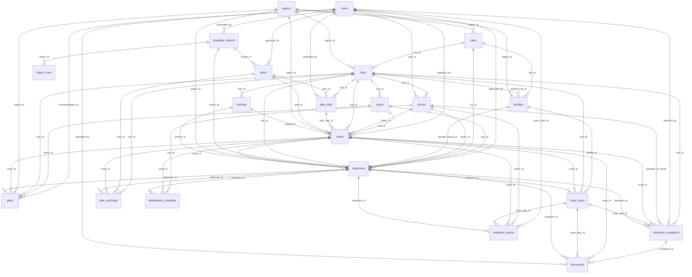

# ٣) نموذج البيانات — الجداول والعلاقات والقيود

> **وثيقة مُولَّدة آليًا** من الشيفرة وقاعدة البيانات في 2026-08-26 21:32 UTC.
> لا تُحرَّر يدويًا: أعد توليدها بـ `PYTHONPATH=packages python3 scripts/gen_docs.py`.

## المبدأ

القيود التشغيلية لا تُترك للتطبيق وحده. ما يمكن التعبير عنه كقيد في
قاعدة البيانات يُكتب قيدًا: `CHECK` للثوابت المنطقية، `EXCLUDE` لمنع
تعارض إسناد السائق أو المركبة، ومحفّزات (triggers) لحراسة الانتقالات
والحذف. هذا يعني أن أي مسار برمجي — حتى لو أخطأ — لا يستطيع كتابة حالة
غير مشروعة.

**الإجمالي:** 50 جدولًا · 112 مفتاحًا خارجيًا · 101 قيد تحقق/استبعاد · 64 محفّزًا.

## مخطط العلاقات (ERD)

العلاقات المفتاحية فقط — المخطط الكامل في جداول الأعمدة أدناه.

## الهيكل التنظيمي والبيانات الرئيسية

### `regions`

| العمود | النوع | إلزامي | يشير إلى | الافتراضي |
|---|---|---|---|---|
| `id` | uuid | نعم | — | `gen_random_uuid()` |
| `code` | text | نعم | — | — |
| `name_ar` | text | نعم | — | — |
| `name_en` | text | لا | — | — |
| `timezone` | text | نعم | — | `'Asia/Riyadh'` |
| `is_active` | boolean | نعم | — | `true` |
| `is_test_data` | boolean | نعم | — | `false` |
| `created_at` | timestamp with time zone | نعم | — | `now()` |
| `updated_at` | timestamp with time zone | نعم | — | `now()` |

**القيود:**

- `regions_code_format` — `CHECK ((code ~ '^[A-Z0-9_-]{2,20}$'::text))`

**المحفّزات:**

- `regions_no_test_data` — regions_no_test_data BEFORE INSERT OR UPDATE ⇒ `app.guard_no_test_data_in_production()`
- `regions_touch` — regions_touch BEFORE UPDATE ⇒ `app.touch_updated_at()`

### `cities`

| العمود | النوع | إلزامي | يشير إلى | الافتراضي |
|---|---|---|---|---|
| `id` | uuid | نعم | — | `gen_random_uuid()` |
| `region_id` | uuid | نعم | `regions` | — |
| `code` | text | نعم | — | — |
| `name_ar` | text | نعم | — | — |
| `name_en` | text | لا | — | — |
| `is_governorate` | boolean | نعم | — | `false` |
| `timezone` | text | نعم | — | `'Asia/Riyadh'` |
| `center_lat` | double precision | لا | — | — |
| `center_lon` | double precision | لا | — | — |
| `is_active` | boolean | نعم | — | `true` |
| `is_test_data` | boolean | نعم | — | `false` |
| `created_at` | timestamp with time zone | نعم | — | `now()` |
| `updated_at` | timestamp with time zone | نعم | — | `now()` |

**القيود:**

- `cities_lat_range` — `CHECK (((center_lat IS NULL) OR ((center_lat >= ('-90'::integer)::double precision) AND (center_lat <= (90)::double precision))))`
- `cities_lon_range` — `CHECK (((center_lon IS NULL) OR ((center_lon >= ('-180'::integer)::double precision) AND (center_lon <= (180)::double precision))))`

**المحفّزات:**

- `cities_no_test_data` — cities_no_test_data BEFORE INSERT OR UPDATE ⇒ `app.guard_no_test_data_in_production()`
- `cities_touch` — cities_touch BEFORE UPDATE ⇒ `app.touch_updated_at()`

### `hubs`

| العمود | النوع | إلزامي | يشير إلى | الافتراضي |
|---|---|---|---|---|
| `id` | uuid | نعم | — | `gen_random_uuid()` |
| `region_id` | uuid | نعم | `regions` | — |
| `city_id` | uuid | نعم | `cities` | — |
| `code` | text | نعم | — | — |
| `name_ar` | text | نعم | — | — |
| `lat` | double precision | نعم | — | — |
| `lon` | double precision | نعم | — | — |
| `address` | text | لا | — | — |
| `contact_name` | text | لا | — | — |
| `contact_phone` | text | لا | — | — |
| `working_hours` | jsonb | لا | — | — |
| `is_active` | boolean | نعم | — | `true` |
| `is_test_data` | boolean | نعم | — | `false` |
| `created_at` | timestamp with time zone | نعم | — | `now()` |
| `updated_at` | timestamp with time zone | نعم | — | `now()` |

**القيود:**

- `hubs_coords_not_null_island` — `CHECK ((NOT ((lat = (0)::double precision) AND (lon = (0)::double precision))))`
- `hubs_lat_range` — `CHECK (((lat >= ('-90'::integer)::double precision) AND (lat <= (90)::double precision)))`
- `hubs_lon_range` — `CHECK (((lon >= ('-180'::integer)::double precision) AND (lon <= (180)::double precision)))`

**المحفّزات:**

- `hubs_no_test_data` — hubs_no_test_data BEFORE INSERT OR UPDATE ⇒ `app.guard_no_test_data_in_production()`
- `hubs_touch` — hubs_touch BEFORE UPDATE ⇒ `app.touch_updated_at()`

### `facilities`

| العمود | النوع | إلزامي | يشير إلى | الافتراضي |
|---|---|---|---|---|
| `id` | uuid | نعم | — | `gen_random_uuid()` |
| `region_id` | uuid | نعم | `regions` | — |
| `city_id` | uuid | نعم | `cities` | — |
| `default_hub_id` | uuid | لا | `hubs` | — |
| `code` | text | نعم | — | — |
| `name_ar` | text | نعم | — | — |
| `name_en` | text | لا | — | — |
| `facility_type` | text | نعم | — | — |
| `lat` | double precision | نعم | — | — |
| `lon` | double precision | نعم | — | — |
| `address` | text | لا | — | — |
| `contact_name` | text | لا | — | — |
| `contact_phone` | text | لا | — | — |
| `contact_email` | text | لا | — | — |
| `service_minutes` | integer | نعم | — | `10` |
| `working_hours` | jsonb | لا | — | — |
| `notes` | text | لا | — | — |
| `is_active` | boolean | نعم | — | `true` |
| `is_test_data` | boolean | نعم | — | `false` |
| `voided_at` | timestamp with time zone | لا | — | — |
| `voided_by` | uuid | لا | — | — |
| `void_reason` | text | لا | — | — |
| `created_at` | timestamp with time zone | نعم | — | `now()` |
| `updated_at` | timestamp with time zone | نعم | — | `now()` |

**القيود:**

- `facilities_coords_not_null_island` — `CHECK ((NOT ((lat = (0)::double precision) AND (lon = (0)::double precision))))`
- `facilities_lat_range` — `CHECK (((lat >= ('-90'::integer)::double precision) AND (lat <= (90)::double precision)))`
- `facilities_lon_range` — `CHECK (((lon >= ('-180'::integer)::double precision) AND (lon <= (180)::double precision)))`
- `facilities_service_minutes_range` — `CHECK (((service_minutes >= 1) AND (service_minutes <= 480)))`
- `facilities_type_valid` — `CHECK ((facility_type = ANY (ARRAY['HEALTH_CENTER'::text, 'HOSPITAL'::text, 'LABORATORY'::text, 'BLOOD_BANK'::text, 'WAREHOUSE'::text, 'CLINIC'::text, 'OTHER'::text])))`
- `facilities_void_reason` — `CHECK (((voided_at IS NULL) OR (void_reason IS NOT NULL)))`

**المحفّزات:**

- `facilities_no_test_data` — facilities_no_test_data BEFORE INSERT OR UPDATE ⇒ `app.guard_no_test_data_in_production()`
- `facilities_touch` — facilities_touch BEFORE UPDATE ⇒ `app.touch_updated_at()`

### `drivers`

| العمود | النوع | إلزامي | يشير إلى | الافتراضي |
|---|---|---|---|---|
| `id` | uuid | نعم | — | `gen_random_uuid()` |
| `user_id` | uuid | لا | `users` | — |
| `hub_id` | uuid | نعم | `hubs` | — |
| `code` | text | نعم | — | — |
| `full_name` | text | نعم | — | — |
| `phone` | text | لا | — | — |
| `national_id` | text | لا | — | — |
| `license_number` | text | لا | — | — |
| `license_expiry` | date | لا | — | — |
| `employment_status` | text | نعم | — | `'ACTIVE'` |
| `shift_start` | time without time zone | لا | — | — |
| `shift_end` | time without time zone | لا | — | — |
| `qualifications` | ARRAY | نعم | — | `'{}'` |
| `is_active` | boolean | نعم | — | `true` |
| `is_test_data` | boolean | نعم | — | `false` |
| `created_at` | timestamp with time zone | نعم | — | `now()` |
| `updated_at` | timestamp with time zone | نعم | — | `now()` |

**القيود:**

- `drivers_status_valid` — `CHECK ((employment_status = ANY (ARRAY['ACTIVE'::text, 'ON_LEAVE'::text, 'SUSPENDED'::text, 'TERMINATED'::text])))`

**المحفّزات:**

- `drivers_no_test_data` — drivers_no_test_data BEFORE INSERT OR UPDATE ⇒ `app.guard_no_test_data_in_production()`
- `drivers_touch` — drivers_touch BEFORE UPDATE ⇒ `app.touch_updated_at()`

### `vehicles`

| العمود | النوع | إلزامي | يشير إلى | الافتراضي |
|---|---|---|---|---|
| `id` | uuid | نعم | — | `gen_random_uuid()` |
| `hub_id` | uuid | نعم | `hubs` | — |
| `plate_number` | text | نعم | — | — |
| `model` | text | لا | — | — |
| `make_year` | integer | لا | — | — |
| `vehicle_type` | text | نعم | — | `'CAR'` |
| `has_cooling` | boolean | نعم | — | `false` |
| `status` | text | نعم | — | `'AVAILABLE'` |
| `is_active` | boolean | نعم | — | `true` |
| `is_test_data` | boolean | نعم | — | `false` |
| `created_at` | timestamp with time zone | نعم | — | `now()` |
| `updated_at` | timestamp with time zone | نعم | — | `now()` |

**القيود:**

- `vehicles_status_valid` — `CHECK ((status = ANY (ARRAY['AVAILABLE'::text, 'IN_USE'::text, 'MAINTENANCE'::text, 'OUT_OF_SERVICE'::text])))`
- `vehicles_type_valid` — `CHECK ((vehicle_type = ANY (ARRAY['CAR'::text, 'VAN'::text, 'TRUCK'::text, 'MOTORCYCLE'::text])))`

**المحفّزات:**

- `vehicles_no_test_data` — vehicles_no_test_data BEFORE INSERT OR UPDATE ⇒ `app.guard_no_test_data_in_production()`
- `vehicles_touch` — vehicles_touch BEFORE UPDATE ⇒ `app.touch_updated_at()`

### `boxes`

| العمود | النوع | إلزامي | يشير إلى | الافتراضي |
|---|---|---|---|---|
| `id` | uuid | نعم | — | `gen_random_uuid()` |
| `hub_id` | uuid | نعم | `hubs` | — |
| `code` | text | نعم | — | — |
| `name_ar` | text | لا | — | — |
| `temperature_mode` | text | نعم | — | `'AMBIENT'` |
| `capacity_units` | integer | لا | — | — |
| `status` | text | نعم | — | `'AVAILABLE'` |
| `is_active` | boolean | نعم | — | `true` |
| `is_test_data` | boolean | نعم | — | `false` |
| `created_at` | timestamp with time zone | نعم | — | `now()` |
| `updated_at` | timestamp with time zone | نعم | — | `now()` |

**القيود:**

- `boxes_mode_valid` — `CHECK ((temperature_mode = ANY (ARRAY['AMBIENT'::text, 'CHILLED'::text, 'FROZEN'::text, 'DEEP_FROZEN'::text, 'CONTROLLED'::text])))`
- `boxes_status_valid` — `CHECK ((status = ANY (ARRAY['AVAILABLE'::text, 'IN_USE'::text, 'MAINTENANCE'::text, 'DAMAGED'::text, 'RETIRED'::text])))`

**المحفّزات:**

- `boxes_no_test_data` — boxes_no_test_data BEFORE INSERT OR UPDATE ⇒ `app.guard_no_test_data_in_production()`
- `boxes_touch` — boxes_touch BEFORE UPDATE ⇒ `app.touch_updated_at()`

### `sensors`

| العمود | النوع | إلزامي | يشير إلى | الافتراضي |
|---|---|---|---|---|
| `id` | uuid | نعم | — | `gen_random_uuid()` |
| `code` | text | نعم | — | — |
| `provider` | text | نعم | — | `'NONE'` |
| `box_id` | uuid | لا | `boxes` | — |
| `vehicle_id` | uuid | لا | `vehicles` | — |
| `is_active` | boolean | نعم | — | `true` |
| `last_seen_at` | timestamp with time zone | لا | — | — |
| `is_test_data` | boolean | نعم | — | `false` |
| `created_at` | timestamp with time zone | نعم | — | `now()` |
| `updated_at` | timestamp with time zone | نعم | — | `now()` |

**القيود:**

- `sensors_binding` — `CHECK (((box_id IS NOT NULL) OR (vehicle_id IS NOT NULL)))`

**المحفّزات:**

- `sensors_no_test_data` — sensors_no_test_data BEFORE INSERT OR UPDATE ⇒ `app.guard_no_test_data_in_production()`
- `sensors_touch` — sensors_touch BEFORE UPDATE ⇒ `app.touch_updated_at()`

### `availability_exceptions`

| العمود | النوع | إلزامي | يشير إلى | الافتراضي |
|---|---|---|---|---|
| `id` | uuid | نعم | — | `gen_random_uuid()` |
| `entity_type` | text | نعم | — | — |
| `entity_id` | uuid | نعم | — | — |
| `from_date` | date | نعم | — | — |
| `to_date` | date | نعم | — | — |
| `is_available` | boolean | نعم | — | `false` |
| `reason_ar` | text | نعم | — | — |
| `created_by` | uuid | لا | `users` | — |
| `created_at` | timestamp with time zone | نعم | — | `now()` |

**القيود:**

- `availability_date_order` — `CHECK ((to_date >= from_date))`
- `availability_entity_valid` — `CHECK ((entity_type = ANY (ARRAY['DRIVER'::text, 'VEHICLE'::text, 'BOX'::text, 'FACILITY'::text, 'HUB'::text])))`

## المستخدمون والأمان

### `users`

| العمود | النوع | إلزامي | يشير إلى | الافتراضي |
|---|---|---|---|---|
| `id` | uuid | نعم | — | `gen_random_uuid()` |
| `email` | text | نعم | — | — |
| `phone` | text | لا | — | — |
| `full_name` | text | نعم | — | — |
| `password_hash` | text | لا | — | — |
| `role` | text | نعم | — | — |
| `custom_role_id` | uuid | لا | `custom_roles` | — |
| `is_active` | boolean | نعم | — | `true` |
| `must_change_password` | boolean | نعم | — | `true` |
| `failed_attempts` | integer | نعم | — | `0` |
| `locked_until` | timestamp with time zone | لا | — | — |
| `last_login_at` | timestamp with time zone | لا | — | — |
| `preferred_locale` | text | نعم | — | `'ar'` |
| `is_test_data` | boolean | نعم | — | `false` |
| `created_by` | uuid | لا | `users` | — |
| `created_at` | timestamp with time zone | نعم | — | `now()` |
| `updated_at` | timestamp with time zone | نعم | — | `now()` |

**القيود:**

- `users_email_format` — `CHECK ((email ~ '^[^@[:space:]]+@[^@[:space:]]+\.[^@[:space:]]+$'::text))`
- `users_role_valid` — `CHECK ((role = ANY (ARRAY['ADMIN'::text, 'CENTRAL_PLANNER'::text, 'HUB_SUPERVISOR'::text, 'DRIVER'::text, 'EXTERNAL_REQUESTER'::text, 'CONTROL_TOWER'::text, 'AUDITOR'::text, 'INTEGRATION'::text])))`

**المحفّزات:**

- `users_no_test_data` — users_no_test_data BEFORE INSERT OR UPDATE ⇒ `app.guard_no_test_data_in_production()`
- `users_touch` — users_touch BEFORE UPDATE ⇒ `app.touch_updated_at()`

### `user_scopes`

| العمود | النوع | إلزامي | يشير إلى | الافتراضي |
|---|---|---|---|---|
| `id` | uuid | نعم | — | `gen_random_uuid()` |
| `user_id` | uuid | نعم | `users` | — |
| `scope_type` | text | نعم | — | — |
| `scope_id` | uuid | نعم | — | — |
| `created_at` | timestamp with time zone | نعم | — | `now()` |

**القيود:**

- `user_scopes_type_valid` — `CHECK ((scope_type = ANY (ARRAY['REGION'::text, 'HUB'::text, 'FACILITY'::text])))`

### `user_sessions`

| العمود | النوع | إلزامي | يشير إلى | الافتراضي |
|---|---|---|---|---|
| `id` | uuid | نعم | — | `gen_random_uuid()` |
| `user_id` | uuid | نعم | `users` | — |
| `refresh_token_hash` | text | نعم | — | — |
| `issued_at` | timestamp with time zone | نعم | — | `now()` |
| `expires_at` | timestamp with time zone | نعم | — | — |
| `last_seen_at` | timestamp with time zone | نعم | — | `now()` |
| `revoked_at` | timestamp with time zone | لا | — | — |
| `revoke_reason` | text | لا | — | — |
| `ip_address` | inet | لا | — | — |
| `user_agent` | text | لا | — | — |
| `previous_token_hash` | text | لا | — | — |
| `rotation_count` | integer | نعم | — | `0` |

**القيود:**

- `user_sessions_expiry` — `CHECK ((expires_at > issued_at))`

### `api_clients`

| العمود | النوع | إلزامي | يشير إلى | الافتراضي |
|---|---|---|---|---|
| `id` | uuid | نعم | — | `gen_random_uuid()` |
| `name` | text | نعم | — | — |
| `key_prefix` | text | نعم | — | — |
| `key_hash` | text | نعم | — | — |
| `facility_id` | uuid | لا | `facilities` | — |
| `scopes` | ARRAY | نعم | — | `'{}'` |
| `is_active` | boolean | نعم | — | `true` |
| `last_used_at` | timestamp with time zone | لا | — | — |
| `expires_at` | timestamp with time zone | لا | — | — |
| `created_by` | uuid | لا | `users` | — |
| `created_at` | timestamp with time zone | نعم | — | `now()` |
| `updated_at` | timestamp with time zone | نعم | — | `now()` |

**المحفّزات:**

- `api_clients_touch` — api_clients_touch BEFORE UPDATE ⇒ `app.touch_updated_at()`

### `audit_log`

| العمود | النوع | إلزامي | يشير إلى | الافتراضي |
|---|---|---|---|---|
| `id` | bigint | نعم | — | `nextval('audit_log_id_seq'` |
| `occurred_at` | timestamp with time zone | نعم | — | `now()` |
| `actor_user_id` | uuid | لا | — | — |
| `actor_role` | text | لا | — | — |
| `actor_name` | text | لا | — | — |
| `action` | text | نعم | — | — |
| `entity_type` | text | لا | — | — |
| `entity_id` | uuid | لا | — | — |
| `entity_label` | text | لا | — | — |
| `old_value` | jsonb | لا | — | — |
| `new_value` | jsonb | لا | — | — |
| `reason` | text | لا | — | — |
| `ip_address` | inet | لا | — | — |
| `user_agent` | text | لا | — | — |
| `request_id` | text | لا | — | — |
| `is_test_data` | boolean | نعم | — | `false` |

**المحفّزات:**

- `audit_log_no_delete` — audit_log_no_delete BEFORE DELETE ⇒ `app.audit_log_is_append_only()`
- `audit_log_no_update` — audit_log_no_update BEFORE UPDATE ⇒ `app.audit_log_is_append_only()`

## الإعدادات

### `operational_settings`

| العمود | النوع | إلزامي | يشير إلى | الافتراضي |
|---|---|---|---|---|
| `id` | uuid | نعم | — | `gen_random_uuid()` |
| `setting_key` | text | نعم | — | — |
| `scope_type` | text | نعم | — | — |
| `scope_id` | uuid | لا | — | — |
| `value` | jsonb | نعم | — | — |
| `reason` | text | لا | — | — |
| `updated_by` | uuid | لا | `users` | — |
| `created_at` | timestamp with time zone | نعم | — | `now()` |
| `updated_at` | timestamp with time zone | نعم | — | `now()` |

**القيود:**

- `operational_settings_kingdom_null` — `CHECK ((((scope_type = 'KINGDOM'::text) AND (scope_id IS NULL)) OR ((scope_type <> 'KINGDOM'::text) AND (scope_id IS NOT NULL))))`
- `operational_settings_scope_valid` — `CHECK ((scope_type = ANY (ARRAY['KINGDOM'::text, 'REGION'::text, 'CITY'::text, 'HUB'::text])))`

**المحفّزات:**

- `operational_settings_touch` — operational_settings_touch BEFORE UPDATE ⇒ `app.touch_updated_at()`

## الاستيراد والتخطيط

### `schedule_imports`

| العمود | النوع | إلزامي | يشير إلى | الافتراضي |
|---|---|---|---|---|
| `id` | uuid | نعم | — | `gen_random_uuid()` |
| `reference` | text | نعم | — | — |
| `original_filename` | text | نعم | — | — |
| `storage_key` | text | نعم | — | — |
| `content_type` | text | لا | — | — |
| `byte_size` | bigint | لا | — | — |
| `sha256` | text | لا | — | — |
| `status` | text | نعم | — | `'UPLOADED'` |
| `period_start` | date | لا | — | — |
| `period_end` | date | لا | — | — |
| `column_mapping` | jsonb | نعم | — | `'{}'` |
| `total_rows` | integer | نعم | — | `0` |
| `valid_rows` | integer | نعم | — | `0` |
| `invalid_rows` | integer | نعم | — | `0` |
| `duplicate_rows` | integer | نعم | — | `0` |
| `summary` | jsonb | نعم | — | `'{}'` |
| `uploaded_by` | uuid | لا | `users` | — |
| `committed_by` | uuid | لا | `users` | — |
| `committed_at` | timestamp with time zone | لا | — | — |
| `is_test_data` | boolean | نعم | — | `false` |
| `created_at` | timestamp with time zone | نعم | — | `now()` |
| `updated_at` | timestamp with time zone | نعم | — | `now()` |

**القيود:**

- `schedule_imports_period_order` — `CHECK (((period_end IS NULL) OR (period_start IS NULL) OR (period_end >= period_start)))`
- `schedule_imports_status_valid` — `CHECK ((status = ANY (ARRAY['UPLOADED'::text, 'MAPPING'::text, 'VALIDATING'::text, 'VALIDATED'::text, 'PARTIALLY_VALID'::text, 'REJECTED'::text, 'COMMITTED'::text])))`

**المحفّزات:**

- `schedule_imports_no_test_data` — schedule_imports_no_test_data BEFORE INSERT OR UPDATE ⇒ `app.guard_no_test_data_in_production()`
- `schedule_imports_touch` — schedule_imports_touch BEFORE UPDATE ⇒ `app.touch_updated_at()`

### `import_rows`

| العمود | النوع | إلزامي | يشير إلى | الافتراضي |
|---|---|---|---|---|
| `id` | uuid | نعم | — | `gen_random_uuid()` |
| `import_id` | uuid | نعم | `schedule_imports` | — |
| `row_number` | integer | نعم | — | — |
| `raw` | jsonb | نعم | — | — |
| `normalized` | jsonb | لا | — | — |
| `is_valid` | boolean | نعم | — | `false` |
| `is_excluded` | boolean | نعم | — | `false` |
| `errors` | jsonb | نعم | — | `'[]'` |
| `warnings` | jsonb | نعم | — | `'[]'` |
| `dedupe_key` | text | لا | — | — |
| `shipment_id` | uuid | لا | — | — |
| `created_at` | timestamp with time zone | نعم | — | `now()` |

### `shipments`

| العمود | النوع | إلزامي | يشير إلى | الافتراضي |
|---|---|---|---|---|
| `id` | uuid | نعم | — | `gen_random_uuid()` |
| `reference` | text | نعم | — | — |
| `external_reference` | text | لا | — | — |
| `request_kind` | text | نعم | — | `'SCHEDULED'` |
| `service_type` | text | نعم | — | `'ROUTINE'` |
| `status` | text | نعم | — | `'DRAFT'` |
| `region_id` | uuid | نعم | `regions` | — |
| `city_id` | uuid | نعم | `cities` | — |
| `hub_id` | uuid | نعم | `hubs` | — |
| `pickup_facility_id` | uuid | نعم | `facilities` | — |
| `pickup_facility_type` | text | نعم | — | — |
| `pickup_contact_name` | text | لا | — | — |
| `pickup_contact_phone` | text | لا | — | — |
| `pickup_address` | text | لا | — | — |
| `pickup_lat` | double precision | نعم | — | — |
| `pickup_lon` | double precision | نعم | — | — |
| `pickup_window_from` | timestamp with time zone | نعم | — | — |
| `pickup_window_to` | timestamp with time zone | نعم | — | — |
| `pickup_service_minutes` | integer | نعم | — | `10` |
| `dropoff_facility_id` | uuid | نعم | `facilities` | — |
| `dropoff_facility_type` | text | نعم | — | — |
| `dropoff_contact_name` | text | لا | — | — |
| `dropoff_contact_phone` | text | لا | — | — |
| `dropoff_address` | text | لا | — | — |
| `dropoff_lat` | double precision | نعم | — | — |
| `dropoff_lon` | double precision | نعم | — | — |
| `sla_deadline` | timestamp with time zone | نعم | — | — |
| `dropoff_service_minutes` | integer | نعم | — | `10` |
| `piece_count` | integer | نعم | — | `1` |
| `sample_types` | ARRAY | نعم | — | `'{}'` |
| `temperature_mode` | text | نعم | — | `'AMBIENT'` |
| `temperature_min_c` | numeric | لا | — | — |
| `temperature_max_c` | numeric | لا | — | — |
| `service_date` | date | نعم | — | — |
| `route_id` | uuid | لا | `routes` | — |
| `driver_id` | uuid | لا | `drivers` | — |
| `vehicle_id` | uuid | لا | `vehicles` | — |
| `box_id` | uuid | لا | `boxes` | — |
| `planned_pickup_arrival` | timestamp with time zone | لا | — | — |
| `planned_pickup_at` | timestamp with time zone | لا | — | — |
| `planned_dropoff_arrival` | timestamp with time zone | لا | — | — |
| `planned_dropoff_at` | timestamp with time zone | لا | — | — |
| `actual_pickup_arrival` | timestamp with time zone | لا | — | — |
| `actual_pickup_at` | timestamp with time zone | لا | — | — |
| `actual_dropoff_arrival` | timestamp with time zone | لا | — | — |
| `actual_dropoff_at` | timestamp with time zone | لا | — | — |
| `sla_breached` | boolean | نعم | — | `false` |
| `pickup_window_breached` | boolean | نعم | — | `false` |
| `delay_minutes` | integer | لا | — | — |
| `failure_reason` | text | لا | — | — |
| `cancel_reason` | text | لا | — | — |
| `unplannable_reason` | text | لا | — | — |
| `unplannable_detail` | text | لا | — | — |
| `delivery_obligation_open` | boolean | نعم | — | `false` |
| `import_id` | uuid | لا | `schedule_imports` | — |
| `import_row_number` | integer | لا | — | — |
| `requested_by` | uuid | لا | `users` | — |
| `requester_facility_id` | uuid | لا | `facilities` | — |
| `approved_by` | uuid | لا | `users` | — |
| `approved_at` | timestamp with time zone | لا | — | — |
| `rejection_reason` | text | لا | — | — |
| `notes` | text | لا | — | — |
| `dedupe_key` | text | لا | — | — |
| `is_test_data` | boolean | نعم | — | `false` |
| `created_at` | timestamp with time zone | نعم | — | `now()` |
| `updated_at` | timestamp with time zone | نعم | — | `now()` |

**القيود:**

- `shipments_actual_order` — `CHECK (((actual_dropoff_at IS NULL) OR (actual_pickup_at IS NULL) OR (actual_dropoff_at >= actual_pickup_at)))`
- `shipments_cancel_reason` — `CHECK (((status <> 'CANCELLED_BEFORE_PICKUP'::text) OR (cancel_reason IS NOT NULL)))`
- `shipments_distinct_endpoints` — `CHECK ((pickup_facility_id <> dropoff_facility_id))`
- `shipments_dropoff_lat` — `CHECK (((dropoff_lat >= ('-90'::integer)::double precision) AND (dropoff_lat <= (90)::double precision)))`
- `shipments_dropoff_lon` — `CHECK (((dropoff_lon >= ('-180'::integer)::double precision) AND (dropoff_lon <= (180)::double precision)))`
- `shipments_kind_valid` — `CHECK ((request_kind = ANY (ARRAY['SCHEDULED'::text, 'ON_DEMAND'::text])))`
- `shipments_pickup_lat` — `CHECK (((pickup_lat >= ('-90'::integer)::double precision) AND (pickup_lat <= (90)::double precision)))`
- `shipments_pickup_lon` — `CHECK (((pickup_lon >= ('-180'::integer)::double precision) AND (pickup_lon <= (180)::double precision)))`
- `shipments_pieces_positive` — `CHECK ((piece_count > 0))`
- `shipments_reject_reason` — `CHECK (((status <> 'REJECTED'::text) OR (rejection_reason IS NOT NULL)))`
- `shipments_service_valid` — `CHECK ((service_type = ANY (ARRAY['ROUTINE'::text, 'URGENT'::text, 'STAT'::text, 'RETURN'::text])))`
- `shipments_sla_after_window` — `CHECK ((sla_deadline > pickup_window_from))`
- `shipments_status_valid` — `CHECK ((status = ANY (ARRAY['DRAFT'::text, 'VALIDATED'::text, 'PENDING_APPROVAL'::text, 'REJECTED'::text, 'PENDING_ASSIGNMENT'::text, 'PLANNED'::text, 'ASSIGNED'::text, 'PUBLISHED'::text, 'IN_PROGRESS'::text, '`
- `shipments_temp_mode_valid` — `CHECK ((temperature_mode = ANY (ARRAY['AMBIENT'::text, 'CHILLED'::text, 'FROZEN'::text, 'DEEP_FROZEN'::text, 'CONTROLLED'::text])))`
- `shipments_unplannable_reason` — `CHECK (((status <> 'UNPLANNABLE'::text) OR (unplannable_reason IS NOT NULL)))`
- `shipments_window_order` — `CHECK ((pickup_window_to >= pickup_window_from))`

**المحفّزات:**

- `shipments_guard_delete` — shipments_guard_delete BEFORE DELETE ⇒ `app.guard_operational_delete()`
- `shipments_guard_transition` — shipments_guard_transition BEFORE UPDATE ⇒ `app.guard_shipment_transition()`
- `shipments_no_test_data` — shipments_no_test_data BEFORE INSERT OR UPDATE ⇒ `app.guard_no_test_data_in_production()`
- `shipments_record_status` — shipments_record_status AFTER UPDATE ⇒ `app.record_shipment_status_change()`
- `shipments_touch` — shipments_touch BEFORE UPDATE ⇒ `app.touch_updated_at()`

### `plans`

| العمود | النوع | إلزامي | يشير إلى | الافتراضي |
|---|---|---|---|---|
| `id` | uuid | نعم | — | `gen_random_uuid()` |
| `reference` | text | نعم | — | — |
| `name_ar` | text | نعم | — | — |
| `status` | text | نعم | — | `'DRAFT'` |
| `scope_type` | text | نعم | — | `'KINGDOM'` |
| `scope_id` | uuid | لا | — | — |
| `period_start` | date | نعم | — | — |
| `period_end` | date | نعم | — | — |
| `import_id` | uuid | لا | `schedule_imports` | — |
| `baseline_plan_id` | uuid | لا | `plans` | — |
| `parameters` | jsonb | نعم | — | `'{}'` |
| `settings_snapshot` | jsonb | نعم | — | `'{}'` |
| `metrics` | jsonb | نعم | — | `'{}'` |
| `engine_name` | text | لا | — | — |
| `engine_version` | text | لا | — | — |
| `routing_provider` | text | لا | — | — |
| `routing_estimated` | boolean | نعم | — | `false` |
| `solve_ms` | integer | لا | — | — |
| `objective_trace` | jsonb | نعم | — | `'[]'` |
| `failure_reason` | text | لا | — | — |
| `created_by` | uuid | لا | `users` | — |
| `approved_by` | uuid | لا | `users` | — |
| `approved_at` | timestamp with time zone | لا | — | — |
| `dispatched_at` | timestamp with time zone | لا | — | — |
| `is_test_data` | boolean | نعم | — | `false` |
| `created_at` | timestamp with time zone | نعم | — | `now()` |
| `updated_at` | timestamp with time zone | نعم | — | `now()` |

**القيود:**

- `plans_period_order` — `CHECK ((period_end >= period_start))`
- `plans_scope_valid` — `CHECK ((scope_type = ANY (ARRAY['KINGDOM'::text, 'REGION'::text, 'CITY'::text, 'HUB'::text])))`
- `plans_status_valid` — `CHECK ((status = ANY (ARRAY['DRAFT'::text, 'OPTIMIZING'::text, 'OPTIMIZED'::text, 'APPROVED'::text, 'DISPATCHED'::text, 'SUPERSEDED'::text, 'FAILED'::text])))`

**المحفّزات:**

- `plans_guard_delete` — plans_guard_delete BEFORE DELETE ⇒ `app.guard_operational_delete()`
- `plans_guard_transition` — plans_guard_transition BEFORE UPDATE ⇒ `app.guard_plan_transition()`
- `plans_no_test_data` — plans_no_test_data BEFORE INSERT OR UPDATE ⇒ `app.guard_no_test_data_in_production()`
- `plans_touch` — plans_touch BEFORE UPDATE ⇒ `app.touch_updated_at()`

### `plan_days`

| العمود | النوع | إلزامي | يشير إلى | الافتراضي |
|---|---|---|---|---|
| `id` | uuid | نعم | — | `gen_random_uuid()` |
| `plan_id` | uuid | نعم | `plans` | — |
| `hub_id` | uuid | نعم | `hubs` | — |
| `service_date` | date | نعم | — | — |
| `is_published` | boolean | نعم | — | `false` |
| `published_at` | timestamp with time zone | لا | — | — |
| `published_by` | uuid | لا | `users` | — |
| `metrics` | jsonb | نعم | — | `'{}'` |
| `created_at` | timestamp with time zone | نعم | — | `now()` |
| `updated_at` | timestamp with time zone | نعم | — | `now()` |

**القيود:**

- `plan_days_publish_meta` — `CHECK (((is_published AND (published_at IS NOT NULL)) OR (NOT is_published)))`

**المحفّزات:**

- `plan_days_touch` — plan_days_touch BEFORE UPDATE ⇒ `app.touch_updated_at()`

### `routes`

| العمود | النوع | إلزامي | يشير إلى | الافتراضي |
|---|---|---|---|---|
| `id` | uuid | نعم | — | `gen_random_uuid()` |
| `reference` | text | نعم | — | — |
| `plan_id` | uuid | لا | `plans` | — |
| `plan_day_id` | uuid | لا | `plan_days` | — |
| `hub_id` | uuid | نعم | `hubs` | — |
| `region_id` | uuid | نعم | `regions` | — |
| `service_date` | date | نعم | — | — |
| `status` | text | نعم | — | `'DRAFT'` |
| `sequence_in_day` | integer | نعم | — | `1` |
| `driver_id` | uuid | لا | `drivers` | — |
| `vehicle_id` | uuid | لا | `vehicles` | — |
| `box_id` | uuid | لا | `boxes` | — |
| `start_lat` | double precision | نعم | — | — |
| `start_lon` | double precision | نعم | — | — |
| `start_node_kind` | text | نعم | — | `'HUB'` |
| `previous_route_id` | uuid | لا | `routes` | — |
| `planned_start_at` | timestamp with time zone | لا | — | — |
| `planned_end_at` | timestamp with time zone | لا | — | — |
| `actual_start_at` | timestamp with time zone | لا | — | — |
| `actual_end_at` | timestamp with time zone | لا | — | — |
| `end_lat` | double precision | لا | — | — |
| `end_lon` | double precision | لا | — | — |
| `distance_km` | numeric | نعم | — | `0` |
| `drive_minutes` | numeric | نعم | — | `0` |
| `service_minutes` | numeric | نعم | — | `0` |
| `wait_minutes` | numeric | نعم | — | `0` |
| `working_minutes` | numeric | نعم | — | `0` |
| `estimated_cost` | numeric | نعم | — | `0` |
| `shipment_count` | integer | نعم | — | `0` |
| `pickup_count` | integer | نعم | — | `0` |
| `delivery_count` | integer | نعم | — | `0` |
| `is_long_haul` | boolean | نعم | — | `false` |
| `max_hub_distance_km` | numeric | نعم | — | `0` |
| `facility_classes` | ARRAY | نعم | — | `'{}'` |
| `mixing_exemption_used` | boolean | نعم | — | `false` |
| `assigned_by` | uuid | لا | `users` | — |
| `assigned_at` | timestamp with time zone | لا | — | — |
| `published_by` | uuid | لا | `users` | — |
| `published_at` | timestamp with time zone | لا | — | — |
| `cancel_reason` | text | لا | — | — |
| `is_test_data` | boolean | نعم | — | `false` |
| `created_at` | timestamp with time zone | نعم | — | `now()` |
| `updated_at` | timestamp with time zone | نعم | — | `now()` |
| `active_window` | tstzrange | لا | — | — |

**القيود:**

- `routes_actual_time_order` — `CHECK (((actual_end_at IS NULL) OR (actual_start_at IS NULL) OR (actual_end_at >= actual_start_at)))`
- `routes_assigned_meta` — `CHECK (((driver_id IS NULL) OR (assigned_at IS NOT NULL)))`
- `routes_driver_no_overlap` — `EXCLUDE USING gist (driver_id WITH =, active_window WITH &&) WHERE (((driver_id IS NOT NULL) AND (status = ANY (ARRAY['ASSIGNED'::text, 'PUBLISHED'::text, 'IN_PROGRESS'::text]))))`
- `routes_published_needs_driver` — `CHECK (((status <> ALL (ARRAY['PUBLISHED'::text, 'IN_PROGRESS'::text, 'COMPLETED'::text])) OR (driver_id IS NOT NULL)))`
- `routes_start_node_valid` — `CHECK ((start_node_kind = ANY (ARRAY['HUB'::text, 'PREVIOUS_ROUTE_END'::text, 'DRIVER_CURRENT_POSITION'::text])))`
- `routes_status_valid` — `CHECK ((status = ANY (ARRAY['DRAFT'::text, 'PLANNED'::text, 'ASSIGNED'::text, 'PUBLISHED'::text, 'IN_PROGRESS'::text, 'COMPLETED'::text, 'CANCELLED'::text])))`
- `routes_time_order` — `CHECK (((planned_end_at IS NULL) OR (planned_start_at IS NULL) OR (planned_end_at >= planned_start_at)))`
- `routes_vehicle_no_overlap` — `EXCLUDE USING gist (vehicle_id WITH =, active_window WITH &&) WHERE (((vehicle_id IS NOT NULL) AND (status = ANY (ARRAY['ASSIGNED'::text, 'PUBLISHED'::text, 'IN_PROGRESS'::text]))))`

**المحفّزات:**

- `routes_guard_delete` — routes_guard_delete BEFORE DELETE ⇒ `app.guard_operational_delete()`
- `routes_guard_publish` — routes_guard_publish BEFORE UPDATE ⇒ `app.guard_route_publish()`
- `routes_guard_transition` — routes_guard_transition BEFORE UPDATE ⇒ `app.guard_route_transition()`
- `routes_no_test_data` — routes_no_test_data BEFORE INSERT OR UPDATE ⇒ `app.guard_no_test_data_in_production()`
- `routes_touch` — routes_touch BEFORE UPDATE ⇒ `app.touch_updated_at()`

### `route_stops`

| العمود | النوع | إلزامي | يشير إلى | الافتراضي |
|---|---|---|---|---|
| `id` | uuid | نعم | — | `gen_random_uuid()` |
| `route_id` | uuid | نعم | `routes` | — |
| `sequence` | integer | نعم | — | — |
| `kind` | text | نعم | — | — |
| `facility_id` | uuid | لا | `facilities` | — |
| `hub_id` | uuid | لا | `hubs` | — |
| `shipment_id` | uuid | لا | `shipments` | — |
| `lat` | double precision | نعم | — | — |
| `lon` | double precision | نعم | — | — |
| `label_ar` | text | نعم | — | — |
| `planned_arrival_at` | timestamp with time zone | لا | — | — |
| `planned_service_start` | timestamp with time zone | لا | — | — |
| `planned_departure_at` | timestamp with time zone | لا | — | — |
| `window_from` | timestamp with time zone | لا | — | — |
| `window_to` | timestamp with time zone | لا | — | — |
| `service_minutes` | numeric | نعم | — | `0` |
| `wait_minutes` | numeric | نعم | — | `0` |
| `leg_distance_km` | numeric | نعم | — | `0` |
| `leg_minutes` | numeric | نعم | — | `0` |
| `leg_is_estimated` | boolean | نعم | — | `false` |
| `status` | text | نعم | — | `'PENDING'` |
| `actual_arrival_at` | timestamp with time zone | لا | — | — |
| `actual_completed_at` | timestamp with time zone | لا | — | — |
| `actual_lat` | double precision | لا | — | — |
| `actual_lon` | double precision | لا | — | — |
| `created_at` | timestamp with time zone | نعم | — | `now()` |
| `updated_at` | timestamp with time zone | نعم | — | `now()` |

**القيود:**

- `route_stops_actual_order` — `CHECK (((actual_completed_at IS NULL) OR (actual_arrival_at IS NULL) OR (actual_completed_at >= actual_arrival_at)))`
- `route_stops_kind_valid` — `CHECK ((kind = ANY (ARRAY['HUB_START'::text, 'PICKUP'::text, 'DELIVERY'::text, 'HUB_END'::text])))`
- `route_stops_shipment_required` — `CHECK ((((kind = ANY (ARRAY['PICKUP'::text, 'DELIVERY'::text])) AND (shipment_id IS NOT NULL)) OR (kind = ANY (ARRAY['HUB_START'::text, 'HUB_END'::text]))))`
- `route_stops_status_valid` — `CHECK ((status = ANY (ARRAY['PENDING'::text, 'ARRIVED'::text, 'DONE'::text, 'SKIPPED'::text, 'FAILED'::text])))`

**المحفّزات:**

- `route_stops_touch` — route_stops_touch BEFORE UPDATE ⇒ `app.touch_updated_at()`

### `plan_warnings`

| العمود | النوع | إلزامي | يشير إلى | الافتراضي |
|---|---|---|---|---|
| `id` | uuid | نعم | — | `gen_random_uuid()` |
| `plan_id` | uuid | نعم | `plans` | — |
| `route_id` | uuid | لا | `routes` | — |
| `shipment_id` | uuid | لا | `shipments` | — |
| `hub_id` | uuid | لا | `hubs` | — |
| `warning_type` | text | نعم | — | — |
| `severity` | text | نعم | — | `'MEDIUM'` |
| `reason_ar` | text | نعم | — | — |
| `affected_entity_ar` | text | نعم | — | — |
| `suggested_action_ar` | text | نعم | — | — |
| `occurred_at` | timestamp with time zone | نعم | — | `now()` |
| `context` | jsonb | نعم | — | `'{}'` |

**القيود:**

- `plan_warnings_has_detail` — `CHECK (((length(btrim(reason_ar)) > 0) AND (length(btrim(affected_entity_ar)) > 0) AND (length(btrim(suggested_action_ar)) > 0)))`
- `plan_warnings_has_target` — `CHECK (((route_id IS NOT NULL) OR (shipment_id IS NOT NULL) OR (hub_id IS NOT NULL)))`
- `plan_warnings_severity_valid` — `CHECK ((severity = ANY (ARRAY['INFO'::text, 'LOW'::text, 'MEDIUM'::text, 'HIGH'::text, 'CRITICAL'::text])))`

### `driver_estimations`

| العمود | النوع | إلزامي | يشير إلى | الافتراضي |
|---|---|---|---|---|
| `id` | uuid | نعم | — | `gen_random_uuid()` |
| `plan_id` | uuid | نعم | `plans` | — |
| `hub_id` | uuid | نعم | `hubs` | — |
| `service_date` | date | نعم | — | — |
| `theoretical_minimum` | integer | نعم | — | — |
| `recommended` | integer | نعم | — | — |
| `available` | integer | نعم | — | — |
| `used` | integer | نعم | — | — |
| `gap` | integer | نعم | — | — |
| `workload_minutes` | numeric | نعم | — | `0` |
| `justification` | jsonb | نعم | — | `'[]'` |
| `sla_impact` | jsonb | نعم | — | `'{}'` |
| `created_at` | timestamp with time zone | نعم | — | `now()` |

### `route_revisions`

| العمود | النوع | إلزامي | يشير إلى | الافتراضي |
|---|---|---|---|---|
| `id` | uuid | نعم | — | `gen_random_uuid()` |
| `route_id` | uuid | نعم | `routes` | — |
| `revision_number` | integer | نعم | — | — |
| `changed_by` | uuid | لا | `users` | — |
| `changed_at` | timestamp with time zone | نعم | — | `now()` |
| `reason` | text | نعم | — | — |
| `change_kind` | text | نعم | — | — |
| `before_snapshot` | jsonb | نعم | — | — |
| `after_snapshot` | jsonb | نعم | — | — |
| `diff_summary` | jsonb | نعم | — | `'{}'` |
| `notified_driver` | boolean | نعم | — | `false` |

**القيود:**

- `route_revisions_kind_valid` — `CHECK ((change_kind = ANY (ARRAY['ADD_STOP'::text, 'REMOVE_STOP'::text, 'REORDER'::text, 'REASSIGN_DRIVER'::text, 'REASSIGN_VEHICLE'::text, 'RESCHEDULE'::text, 'CANCEL'::text, 'OTHER'::text])))`
- `route_revisions_reason_present` — `CHECK ((length(btrim(reason)) >= 3))`

## التشغيل والتتبع

### `shipment_events`

| العمود | النوع | إلزامي | يشير إلى | الافتراضي |
|---|---|---|---|---|
| `id` | uuid | نعم | — | `gen_random_uuid()` |
| `shipment_id` | uuid | نعم | `shipments` | — |
| `route_id` | uuid | لا | `routes` | — |
| `route_stop_id` | uuid | لا | `route_stops` | — |
| `event_type` | text | نعم | — | — |
| `occurred_at` | timestamp with time zone | نعم | — | — |
| `received_at` | timestamp with time zone | نعم | — | `now()` |
| `lat` | double precision | لا | — | — |
| `lon` | double precision | لا | — | — |
| `accuracy_m` | numeric | لا | — | — |
| `driver_id` | uuid | لا | `drivers` | — |
| `actor_user_id` | uuid | لا | `users` | — |
| `client_event_id` | text | لا | — | — |
| `was_offline` | boolean | نعم | — | `false` |
| `payload` | jsonb | نعم | — | `'{}'` |
| `is_test_data` | boolean | نعم | — | `false` |

**القيود:**

- `shipment_events_type_valid` — `CHECK ((event_type = ANY (ARRAY['ROUTE_STARTED'::text, 'ARRIVED_PICKUP'::text, 'PICKED_UP'::text, 'ARRIVED_DELIVERY'::text, 'DELIVERED'::text, 'EXCEPTION_RECORDED'::text, 'CANCELLED'::text, 'DOCUMENT_UPLOADED':`

**المحفّزات:**

- `shipment_events_guard_delete` — shipment_events_guard_delete BEFORE DELETE ⇒ `app.guard_operational_delete()`

### `shipment_status_history`

| العمود | النوع | إلزامي | يشير إلى | الافتراضي |
|---|---|---|---|---|
| `id` | bigint | نعم | — | `nextval('shipment_status_history_i` |
| `shipment_id` | uuid | نعم | `shipments` | — |
| `from_status` | text | لا | — | — |
| `to_status` | text | نعم | — | — |
| `changed_at` | timestamp with time zone | نعم | — | `now()` |
| `changed_by` | uuid | لا | `users` | — |
| `actor_role` | text | لا | — | — |
| `reason` | text | لا | — | — |
| `source` | text | نعم | — | `'API'` |
| `context` | jsonb | نعم | — | `'{}'` |

### `documents`

| العمود | النوع | إلزامي | يشير إلى | الافتراضي |
|---|---|---|---|---|
| `id` | uuid | نعم | — | `gen_random_uuid()` |
| `shipment_id` | uuid | لا | `shipments` | — |
| `route_id` | uuid | لا | `routes` | — |
| `route_stop_id` | uuid | لا | `route_stops` | — |
| `exception_id` | uuid | لا | `shipment_exceptions` | — |
| `doc_kind` | text | نعم | — | — |
| `storage_key` | text | نعم | — | — |
| `original_name` | text | لا | — | — |
| `content_type` | text | نعم | — | — |
| `byte_size` | bigint | نعم | — | — |
| `sha256` | text | نعم | — | — |
| `captured_at` | timestamp with time zone | لا | — | — |
| `lat` | double precision | لا | — | — |
| `lon` | double precision | لا | — | — |
| `uploaded_by` | uuid | لا | `users` | — |
| `uploaded_at` | timestamp with time zone | نعم | — | `now()` |
| `is_test_data` | boolean | نعم | — | `false` |

**القيود:**

- `documents_kind_valid` — `CHECK ((doc_kind = ANY (ARRAY['PICKUP_PROOF'::text, 'DELIVERY_PROOF'::text, 'EXCEPTION_PROOF'::text, 'TEMPERATURE_LOG'::text, 'OTHER'::text])))`
- `documents_size_positive` — `CHECK ((byte_size > 0))`
- `documents_type_allowed` — `CHECK ((content_type = ANY (ARRAY['image/jpeg'::text, 'image/png'::text, 'image/webp'::text, 'application/pdf'::text])))`

**المحفّزات:**

- `documents_guard_delete` — documents_guard_delete BEFORE DELETE ⇒ `app.guard_operational_delete()`
- `documents_no_test_data` — documents_no_test_data BEFORE INSERT OR UPDATE ⇒ `app.guard_no_test_data_in_production()`

### `shipment_exceptions`

| العمود | النوع | إلزامي | يشير إلى | الافتراضي |
|---|---|---|---|---|
| `id` | uuid | نعم | — | `gen_random_uuid()` |
| `shipment_id` | uuid | نعم | `shipments` | — |
| `route_id` | uuid | لا | `routes` | — |
| `route_stop_id` | uuid | لا | `route_stops` | — |
| `hub_id` | uuid | نعم | `hubs` | — |
| `reason` | text | نعم | — | — |
| `note` | text | لا | — | — |
| `occurred_at` | timestamp with time zone | نعم | — | `now()` |
| `lat` | double precision | لا | — | — |
| `lon` | double precision | لا | — | — |
| `reported_by` | uuid | لا | `users` | — |
| `reported_by_driver` | uuid | لا | `drivers` | — |
| `status` | text | نعم | — | `'OPEN'` |
| `keeps_obligation` | boolean | نعم | — | `false` |
| `action_taken` | text | لا | — | — |
| `resolution` | text | لا | — | — |
| `resolved_by` | uuid | لا | `users` | — |
| `resolved_at` | timestamp with time zone | لا | — | — |
| `is_test_data` | boolean | نعم | — | `false` |
| `created_at` | timestamp with time zone | نعم | — | `now()` |

**القيود:**

- `shipment_exceptions_reason_valid` — `CHECK ((reason = ANY (ARRAY['NO_SAMPLES'::text, 'SAMPLES_NOT_READY'::text, 'FACILITY_CLOSED'::text, 'NO_STAFF'::text, 'CANCELLED_BEFORE_PICKUP'::text, 'PICKUP_DELAYED'::text, 'DELIVERY_DELAYED'::text, 'TEMPERAT`
- `shipment_exceptions_resolution` — `CHECK (((status <> 'RESOLVED'::text) OR ((action_taken IS NOT NULL) AND (resolved_by IS NOT NULL) AND (resolved_at IS NOT NULL))))`
- `shipment_exceptions_status_valid` — `CHECK ((status = ANY (ARRAY['OPEN'::text, 'ACKNOWLEDGED'::text, 'RESOLVED'::text])))`

**المحفّزات:**

- `shipment_exceptions_guard_delete` — shipment_exceptions_guard_delete BEFORE DELETE ⇒ `app.guard_operational_delete()`
- `shipment_exceptions_no_test_data` — shipment_exceptions_no_test_data BEFORE INSERT OR UPDATE ⇒ `app.guard_no_test_data_in_production()`

### `alerts`

| العمود | النوع | إلزامي | يشير إلى | الافتراضي |
|---|---|---|---|---|
| `id` | uuid | نعم | — | `gen_random_uuid()` |
| `alert_type` | text | نعم | — | — |
| `severity` | text | نعم | — | — |
| `title_ar` | text | نعم | — | — |
| `body_ar` | text | نعم | — | — |
| `shipment_id` | uuid | لا | `shipments` | — |
| `route_id` | uuid | لا | `routes` | — |
| `hub_id` | uuid | لا | `hubs` | — |
| `region_id` | uuid | لا | `regions` | — |
| `driver_id` | uuid | لا | `drivers` | — |
| `responsible_user_id` | uuid | لا | `users` | — |
| `context` | jsonb | نعم | — | `'{}'` |
| `dedupe_key` | text | لا | — | — |
| `created_at` | timestamp with time zone | نعم | — | `now()` |
| `acknowledged_by` | uuid | لا | `users` | — |
| `acknowledged_at` | timestamp with time zone | لا | — | — |
| `resolved_at` | timestamp with time zone | لا | — | — |
| `action_note` | text | لا | — | — |
| `is_test_data` | boolean | نعم | — | `false` |

**القيود:**

- `alerts_has_target` — `CHECK (((shipment_id IS NOT NULL) OR (route_id IS NOT NULL) OR (hub_id IS NOT NULL)))`
- `alerts_resolution_note` — `CHECK (((resolved_at IS NULL) OR (action_note IS NOT NULL)))`
- `alerts_severity_valid` — `CHECK ((severity = ANY (ARRAY['INFO'::text, 'LOW'::text, 'MEDIUM'::text, 'HIGH'::text, 'CRITICAL'::text])))`
- `alerts_type_valid` — `CHECK ((alert_type = ANY (ARRAY['PICKUP_WINDOW_APPROACHING'::text, 'PICKUP_LATE'::text, 'DELIVERY_LATE'::text, 'SLA_AT_RISK'::text, 'SLA_BREACHED'::text, 'REQUEST_CANCELLED'::text, 'SAMPLES_NOT_READY'::text, 'P`

**المحفّزات:**

- `alerts_no_test_data` — alerts_no_test_data BEFORE INSERT OR UPDATE ⇒ `app.guard_no_test_data_in_production()`

### `driver_positions` · **مقسّم بالمدى (partitioned)**

| العمود | النوع | إلزامي | يشير إلى | الافتراضي |
|---|---|---|---|---|
| `id` | bigint | نعم | — | `nextval('driver_positions_id_seq'` |
| `driver_id` | uuid | نعم | — | — |
| `route_id` | uuid | لا | — | — |
| `lat` | double precision | نعم | — | — |
| `lon` | double precision | نعم | — | — |
| `speed_kmh` | numeric | لا | — | — |
| `heading_deg` | numeric | لا | — | — |
| `accuracy_m` | numeric | لا | — | — |
| `battery_pct` | numeric | لا | — | — |
| `recorded_at` | timestamp with time zone | نعم | — | — |
| `received_at` | timestamp with time zone | نعم | — | `now()` |
| `is_test_data` | boolean | نعم | — | `false` |

**القيود:**

- `driver_positions_lat` — `CHECK (((lat >= ('-90'::integer)::double precision) AND (lat <= (90)::double precision)))`
- `driver_positions_lon` — `CHECK (((lon >= ('-180'::integer)::double precision) AND (lon <= (180)::double precision)))`

**المحفّزات:**

- `driver_positions_last` — driver_positions_last AFTER INSERT ⇒ `app.upsert_driver_last_position()`
- `driver_positions_no_test_data` — driver_positions_no_test_data BEFORE INSERT OR UPDATE ⇒ `app.guard_no_test_data_in_production()`

### `driver_last_position`

| العمود | النوع | إلزامي | يشير إلى | الافتراضي |
|---|---|---|---|---|
| `driver_id` | uuid | نعم | `drivers` | — |
| `route_id` | uuid | لا | `routes` | — |
| `lat` | double precision | نعم | — | — |
| `lon` | double precision | نعم | — | — |
| `speed_kmh` | numeric | لا | — | — |
| `heading_deg` | numeric | لا | — | — |
| `recorded_at` | timestamp with time zone | نعم | — | — |
| `received_at` | timestamp with time zone | نعم | — | `now()` |

### `temperature_readings`

| العمود | النوع | إلزامي | يشير إلى | الافتراضي |
|---|---|---|---|---|
| `id` | bigint | نعم | — | `nextval('temperature_readings_id_s` |
| `sensor_id` | uuid | لا | `sensors` | — |
| `box_id` | uuid | لا | `boxes` | — |
| `shipment_id` | uuid | لا | `shipments` | — |
| `route_id` | uuid | لا | `routes` | — |
| `celsius` | numeric | نعم | — | — |
| `humidity_pct` | numeric | لا | — | — |
| `recorded_at` | timestamp with time zone | نعم | — | — |
| `received_at` | timestamp with time zone | نعم | — | `now()` |
| `source` | text | نعم | — | — |
| `status` | text | نعم | — | `'IN_RANGE'` |
| `is_test_data` | boolean | نعم | — | `false` |

**القيود:**

- `temperature_source_valid` — `CHECK ((source = ANY (ARRAY['SENSOR'::text, 'GATEWAY'::text, 'SIMULATION'::text, 'MANUAL_ADMIN'::text])))`
- `temperature_status_valid` — `CHECK ((status = ANY (ARRAY['IN_RANGE'::text, 'BREACH_HIGH'::text, 'BREACH_LOW'::text, 'NO_SENSOR'::text, 'STALE'::text])))`

**المحفّزات:**

- `temperature_readings_guard_delete` — temperature_readings_guard_delete BEFORE DELETE ⇒ `app.guard_operational_delete()`
- `temperature_readings_no_test_data` — temperature_readings_no_test_data BEFORE INSERT OR UPDATE ⇒ `app.guard_no_test_data_in_production()`

### `temperature_breaches`

| العمود | النوع | إلزامي | يشير إلى | الافتراضي |
|---|---|---|---|---|
| `id` | uuid | نعم | — | `gen_random_uuid()` |
| `shipment_id` | uuid | لا | `shipments` | — |
| `box_id` | uuid | لا | `boxes` | — |
| `route_id` | uuid | لا | `routes` | — |
| `sensor_id` | uuid | لا | `sensors` | — |
| `started_at` | timestamp with time zone | نعم | — | — |
| `ended_at` | timestamp with time zone | لا | — | — |
| `duration_minutes` | numeric | لا | — | — |
| `min_celsius` | numeric | لا | — | — |
| `max_celsius` | numeric | لا | — | — |
| `required_min_c` | numeric | لا | — | — |
| `required_max_c` | numeric | لا | — | — |
| `breach_kind` | text | نعم | — | — |
| `action_taken` | text | لا | — | — |
| `resolved_by` | uuid | لا | `users` | — |
| `resolved_at` | timestamp with time zone | لا | — | — |
| `is_test_data` | boolean | نعم | — | `false` |
| `created_at` | timestamp with time zone | نعم | — | `now()` |

**القيود:**

- `temperature_breach_kind_valid` — `CHECK ((breach_kind = ANY (ARRAY['HIGH'::text, 'LOW'::text])))`
- `temperature_breach_order` — `CHECK (((ended_at IS NULL) OR (ended_at >= started_at)))`

### `custody_transfers`

| العمود | النوع | إلزامي | يشير إلى | الافتراضي |
|---|---|---|---|---|
| `id` | uuid | نعم | — | `gen_random_uuid()` |
| `shipment_id` | uuid | نعم | `shipments` | — |
| `from_party` | text | نعم | — | — |
| `to_party` | text | نعم | — | — |
| `from_entity_id` | uuid | لا | — | — |
| `to_entity_id` | uuid | لا | — | — |
| `box_id` | uuid | لا | `boxes` | — |
| `occurred_at` | timestamp with time zone | نعم | — | — |
| `lat` | double precision | لا | — | — |
| `lon` | double precision | لا | — | — |
| `document_id` | uuid | لا | `documents` | — |
| `created_at` | timestamp with time zone | نعم | — | `now()` |

**القيود:**

- `custody_party_valid` — `CHECK (((from_party = ANY (ARRAY['FACILITY'::text, 'DRIVER'::text, 'HUB'::text, 'LAB'::text])) AND (to_party = ANY (ARRAY['FACILITY'::text, 'DRIVER'::text, 'HUB'::text, 'LAB'::text]))))`

**المحفّزات:**

- `custody_transfers_guard_delete` — custody_transfers_guard_delete BEFORE DELETE ⇒ `app.guard_operational_delete()`

### `system_events`

| العمود | النوع | إلزامي | يشير إلى | الافتراضي |
|---|---|---|---|---|
| `id` | bigint | نعم | — | `nextval('system_events_id_seq'` |
| `topic` | text | نعم | — | — |
| `payload` | jsonb | نعم | — | — |
| `hub_id` | uuid | لا | — | — |
| `region_id` | uuid | لا | — | — |
| `driver_id` | uuid | لا | — | — |
| `user_id` | uuid | لا | — | — |
| `created_at` | timestamp with time zone | نعم | — | `now()` |

**المحفّزات:**

- `system_events_notify` — system_events_notify AFTER INSERT ⇒ `app.publish_system_event()`

## قواعد الانتقال

### `allowed_transitions`

| العمود | النوع | إلزامي | يشير إلى | الافتراضي |
|---|---|---|---|---|
| `entity` | text | نعم | — | — |
| `from_status` | text | نعم | — | — |
| `to_status` | text | نعم | — | — |
| `permission` | text | نعم | — | — |
| `requires_reason` | boolean | نعم | — | `false` |
| `label_ar` | text | لا | — | — |

## جداول أخرى

### `custom_roles`

| العمود | النوع | إلزامي | يشير إلى | الافتراضي |
|---|---|---|---|---|
| `id` | uuid | نعم | — | `gen_random_uuid()` |
| `key` | text | نعم | — | — |
| `name_ar` | text | نعم | — | — |
| `base_role` | text | نعم | — | — |
| `permissions` | ARRAY | نعم | — | `'{}'` |
| `is_active` | boolean | نعم | — | `true` |
| `created_by` | uuid | لا | — | — |
| `created_at` | timestamp with time zone | نعم | — | `now()` |
| `updated_at` | timestamp with time zone | نعم | — | `now()` |

**القيود:**

- `custom_roles_base_valid` — `CHECK ((base_role = ANY (ARRAY['ADMIN'::text, 'CENTRAL_PLANNER'::text, 'HUB_SUPERVISOR'::text, 'DRIVER'::text, 'EXTERNAL_REQUESTER'::text, 'CONTROL_TOWER'::text, 'AUDITOR'::text, 'INTEGRATION'::text])))`

**المحفّزات:**

- `custom_roles_touch` — custom_roles_touch BEFORE UPDATE ⇒ `app.touch_updated_at()`

### `driver_positions_2026_07`

| العمود | النوع | إلزامي | يشير إلى | الافتراضي |
|---|---|---|---|---|
| `id` | bigint | نعم | — | `nextval('driver_positions_id_seq'` |
| `driver_id` | uuid | نعم | — | — |
| `route_id` | uuid | لا | — | — |
| `lat` | double precision | نعم | — | — |
| `lon` | double precision | نعم | — | — |
| `speed_kmh` | numeric | لا | — | — |
| `heading_deg` | numeric | لا | — | — |
| `accuracy_m` | numeric | لا | — | — |
| `battery_pct` | numeric | لا | — | — |
| `recorded_at` | timestamp with time zone | نعم | — | — |
| `received_at` | timestamp with time zone | نعم | — | `now()` |
| `is_test_data` | boolean | نعم | — | `false` |

**القيود:**

- `driver_positions_lat` — `CHECK (((lat >= ('-90'::integer)::double precision) AND (lat <= (90)::double precision)))`
- `driver_positions_lon` — `CHECK (((lon >= ('-180'::integer)::double precision) AND (lon <= (180)::double precision)))`

**المحفّزات:**

- `driver_positions_last` — driver_positions_last AFTER INSERT ⇒ `app.upsert_driver_last_position()`
- `driver_positions_no_test_data` — driver_positions_no_test_data BEFORE INSERT OR UPDATE ⇒ `app.guard_no_test_data_in_production()`

### `driver_positions_2026_08`

| العمود | النوع | إلزامي | يشير إلى | الافتراضي |
|---|---|---|---|---|
| `id` | bigint | نعم | — | `nextval('driver_positions_id_seq'` |
| `driver_id` | uuid | نعم | — | — |
| `route_id` | uuid | لا | — | — |
| `lat` | double precision | نعم | — | — |
| `lon` | double precision | نعم | — | — |
| `speed_kmh` | numeric | لا | — | — |
| `heading_deg` | numeric | لا | — | — |
| `accuracy_m` | numeric | لا | — | — |
| `battery_pct` | numeric | لا | — | — |
| `recorded_at` | timestamp with time zone | نعم | — | — |
| `received_at` | timestamp with time zone | نعم | — | `now()` |
| `is_test_data` | boolean | نعم | — | `false` |

**القيود:**

- `driver_positions_lat` — `CHECK (((lat >= ('-90'::integer)::double precision) AND (lat <= (90)::double precision)))`
- `driver_positions_lon` — `CHECK (((lon >= ('-180'::integer)::double precision) AND (lon <= (180)::double precision)))`

**المحفّزات:**

- `driver_positions_last` — driver_positions_last AFTER INSERT ⇒ `app.upsert_driver_last_position()`
- `driver_positions_no_test_data` — driver_positions_no_test_data BEFORE INSERT OR UPDATE ⇒ `app.guard_no_test_data_in_production()`

### `driver_positions_2026_09`

| العمود | النوع | إلزامي | يشير إلى | الافتراضي |
|---|---|---|---|---|
| `id` | bigint | نعم | — | `nextval('driver_positions_id_seq'` |
| `driver_id` | uuid | نعم | — | — |
| `route_id` | uuid | لا | — | — |
| `lat` | double precision | نعم | — | — |
| `lon` | double precision | نعم | — | — |
| `speed_kmh` | numeric | لا | — | — |
| `heading_deg` | numeric | لا | — | — |
| `accuracy_m` | numeric | لا | — | — |
| `battery_pct` | numeric | لا | — | — |
| `recorded_at` | timestamp with time zone | نعم | — | — |
| `received_at` | timestamp with time zone | نعم | — | `now()` |
| `is_test_data` | boolean | نعم | — | `false` |

**القيود:**

- `driver_positions_lat` — `CHECK (((lat >= ('-90'::integer)::double precision) AND (lat <= (90)::double precision)))`
- `driver_positions_lon` — `CHECK (((lon >= ('-180'::integer)::double precision) AND (lon <= (180)::double precision)))`

**المحفّزات:**

- `driver_positions_last` — driver_positions_last AFTER INSERT ⇒ `app.upsert_driver_last_position()`
- `driver_positions_no_test_data` — driver_positions_no_test_data BEFORE INSERT OR UPDATE ⇒ `app.guard_no_test_data_in_production()`

### `driver_positions_2026_10`

| العمود | النوع | إلزامي | يشير إلى | الافتراضي |
|---|---|---|---|---|
| `id` | bigint | نعم | — | `nextval('driver_positions_id_seq'` |
| `driver_id` | uuid | نعم | — | — |
| `route_id` | uuid | لا | — | — |
| `lat` | double precision | نعم | — | — |
| `lon` | double precision | نعم | — | — |
| `speed_kmh` | numeric | لا | — | — |
| `heading_deg` | numeric | لا | — | — |
| `accuracy_m` | numeric | لا | — | — |
| `battery_pct` | numeric | لا | — | — |
| `recorded_at` | timestamp with time zone | نعم | — | — |
| `received_at` | timestamp with time zone | نعم | — | `now()` |
| `is_test_data` | boolean | نعم | — | `false` |

**القيود:**

- `driver_positions_lat` — `CHECK (((lat >= ('-90'::integer)::double precision) AND (lat <= (90)::double precision)))`
- `driver_positions_lon` — `CHECK (((lon >= ('-180'::integer)::double precision) AND (lon <= (180)::double precision)))`

**المحفّزات:**

- `driver_positions_last` — driver_positions_last AFTER INSERT ⇒ `app.upsert_driver_last_position()`
- `driver_positions_no_test_data` — driver_positions_no_test_data BEFORE INSERT OR UPDATE ⇒ `app.guard_no_test_data_in_production()`

### `driver_positions_2026_11`

| العمود | النوع | إلزامي | يشير إلى | الافتراضي |
|---|---|---|---|---|
| `id` | bigint | نعم | — | `nextval('driver_positions_id_seq'` |
| `driver_id` | uuid | نعم | — | — |
| `route_id` | uuid | لا | — | — |
| `lat` | double precision | نعم | — | — |
| `lon` | double precision | نعم | — | — |
| `speed_kmh` | numeric | لا | — | — |
| `heading_deg` | numeric | لا | — | — |
| `accuracy_m` | numeric | لا | — | — |
| `battery_pct` | numeric | لا | — | — |
| `recorded_at` | timestamp with time zone | نعم | — | — |
| `received_at` | timestamp with time zone | نعم | — | `now()` |
| `is_test_data` | boolean | نعم | — | `false` |

**القيود:**

- `driver_positions_lat` — `CHECK (((lat >= ('-90'::integer)::double precision) AND (lat <= (90)::double precision)))`
- `driver_positions_lon` — `CHECK (((lon >= ('-180'::integer)::double precision) AND (lon <= (180)::double precision)))`

**المحفّزات:**

- `driver_positions_last` — driver_positions_last AFTER INSERT ⇒ `app.upsert_driver_last_position()`
- `driver_positions_no_test_data` — driver_positions_no_test_data BEFORE INSERT OR UPDATE ⇒ `app.guard_no_test_data_in_production()`

### `facility_contacts`

| العمود | النوع | إلزامي | يشير إلى | الافتراضي |
|---|---|---|---|---|
| `id` | uuid | نعم | — | `gen_random_uuid()` |
| `facility_id` | uuid | نعم | `facilities` | — |
| `name` | text | نعم | — | — |
| `phone` | text | لا | — | — |
| `email` | text | لا | — | — |
| `role_ar` | text | لا | — | — |
| `is_primary` | boolean | نعم | — | `false` |
| `created_at` | timestamp with time zone | نعم | — | `now()` |

### `holidays`

| العمود | النوع | إلزامي | يشير إلى | الافتراضي |
|---|---|---|---|---|
| `id` | uuid | نعم | — | `gen_random_uuid()` |
| `scope_type` | text | نعم | — | `'KINGDOM'` |
| `scope_id` | uuid | لا | — | — |
| `holiday_date` | date | نعم | — | — |
| `name_ar` | text | نعم | — | — |
| `is_working` | boolean | نعم | — | `false` |
| `created_at` | timestamp with time zone | نعم | — | `now()` |

**القيود:**

- `holidays_scope_valid` — `CHECK ((scope_type = ANY (ARRAY['KINGDOM'::text, 'REGION'::text, 'CITY'::text, 'HUB'::text])))`

### `login_attempts`

| العمود | النوع | إلزامي | يشير إلى | الافتراضي |
|---|---|---|---|---|
| `id` | bigint | نعم | — | `nextval('login_attempts_id_seq'` |
| `email` | text | نعم | — | — |
| `succeeded` | boolean | نعم | — | — |
| `ip_address` | inet | لا | — | — |
| `user_agent` | text | لا | — | — |
| `failure_code` | text | لا | — | — |
| `attempted_at` | timestamp with time zone | نعم | — | `now()` |

### `notifications`

| العمود | النوع | إلزامي | يشير إلى | الافتراضي |
|---|---|---|---|---|
| `id` | uuid | نعم | — | `gen_random_uuid()` |
| `channel` | text | نعم | — | — |
| `recipient` | text | نعم | — | — |
| `subject_ar` | text | لا | — | — |
| `body_ar` | text | نعم | — | — |
| `status` | text | نعم | — | `'PENDING'` |
| `priority` | text | نعم | — | `'NORMAL'` |
| `alert_id` | uuid | لا | `alerts` | — |
| `shipment_id` | uuid | لا | `shipments` | — |
| `route_id` | uuid | لا | `routes` | — |
| `hub_id` | uuid | لا | `hubs` | — |
| `user_id` | uuid | لا | `users` | — |
| `attempts` | integer | نعم | — | `0` |
| `max_attempts` | integer | نعم | — | `5` |
| `next_attempt_at` | timestamp with time zone | نعم | — | `now()` |
| `last_error` | text | لا | — | — |
| `provider` | text | لا | — | — |
| `provider_ref` | text | لا | — | — |
| `dedupe_key` | text | لا | — | — |
| `created_at` | timestamp with time zone | نعم | — | `now()` |
| `sent_at` | timestamp with time zone | لا | — | — |
| `is_test_data` | boolean | نعم | — | `false` |

**القيود:**

- `notifications_channel_valid` — `CHECK ((channel = ANY (ARRAY['SMS'::text, 'EMAIL'::text, 'PUSH'::text, 'WEBHOOK'::text, 'LOG'::text])))`
- `notifications_failure_reason` — `CHECK (((status <> 'FAILED'::text) OR (last_error IS NOT NULL)))`
- `notifications_priority_valid` — `CHECK ((priority = ANY (ARRAY['LOW'::text, 'NORMAL'::text, 'HIGH'::text, 'CRITICAL'::text])))`
- `notifications_sent_at` — `CHECK (((status <> 'SENT'::text) OR (sent_at IS NOT NULL)))`
- `notifications_status_valid` — `CHECK ((status = ANY (ARRAY['PENDING'::text, 'SENDING'::text, 'SENT'::text, 'FAILED'::text, 'CANCELLED'::text, 'NO_PROVIDER'::text])))`

### `password_resets`

| العمود | النوع | إلزامي | يشير إلى | الافتراضي |
|---|---|---|---|---|
| `id` | uuid | نعم | — | `gen_random_uuid()` |
| `user_id` | uuid | نعم | `users` | — |
| `token_hash` | text | نعم | — | — |
| `expires_at` | timestamp with time zone | نعم | — | — |
| `used_at` | timestamp with time zone | لا | — | — |
| `created_at` | timestamp with time zone | نعم | — | `now()` |

### `schema_migrations`

| العمود | النوع | إلزامي | يشير إلى | الافتراضي |
|---|---|---|---|---|
| `version` | text | نعم | — | — |
| `checksum` | text | نعم | — | — |
| `applied_at` | timestamp with time zone | نعم | — | `now()` |
| `duration_ms` | integer | نعم | — | `0` |

### `temperature_ranges`

| العمود | النوع | إلزامي | يشير إلى | الافتراضي |
|---|---|---|---|---|
| `id` | uuid | نعم | — | `gen_random_uuid()` |
| `mode` | text | نعم | — | — |
| `name_ar` | text | نعم | — | — |
| `min_celsius` | numeric | نعم | — | — |
| `max_celsius` | numeric | نعم | — | — |
| `is_active` | boolean | نعم | — | `true` |
| `created_at` | timestamp with time zone | نعم | — | `now()` |
| `updated_at` | timestamp with time zone | نعم | — | `now()` |

**القيود:**

- `temperature_ranges_order` — `CHECK ((min_celsius < max_celsius))`

**المحفّزات:**

- `temperature_ranges_touch` — temperature_ranges_touch BEFORE UPDATE ⇒ `app.touch_updated_at()`
