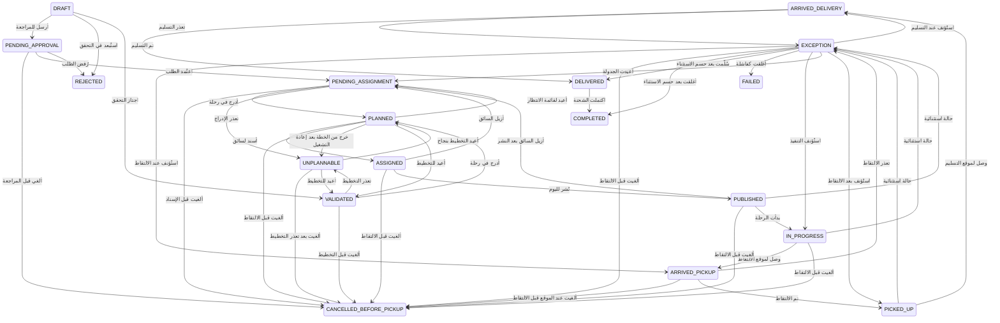
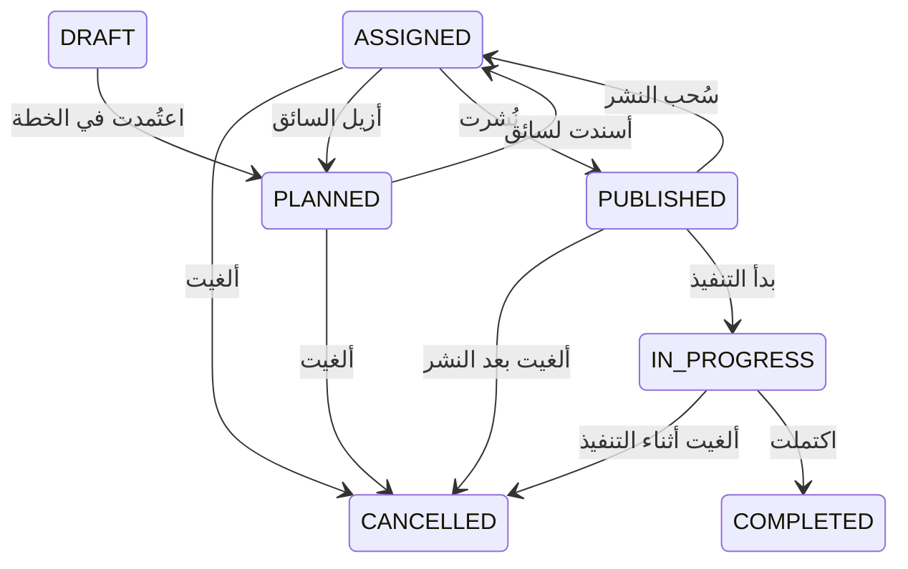
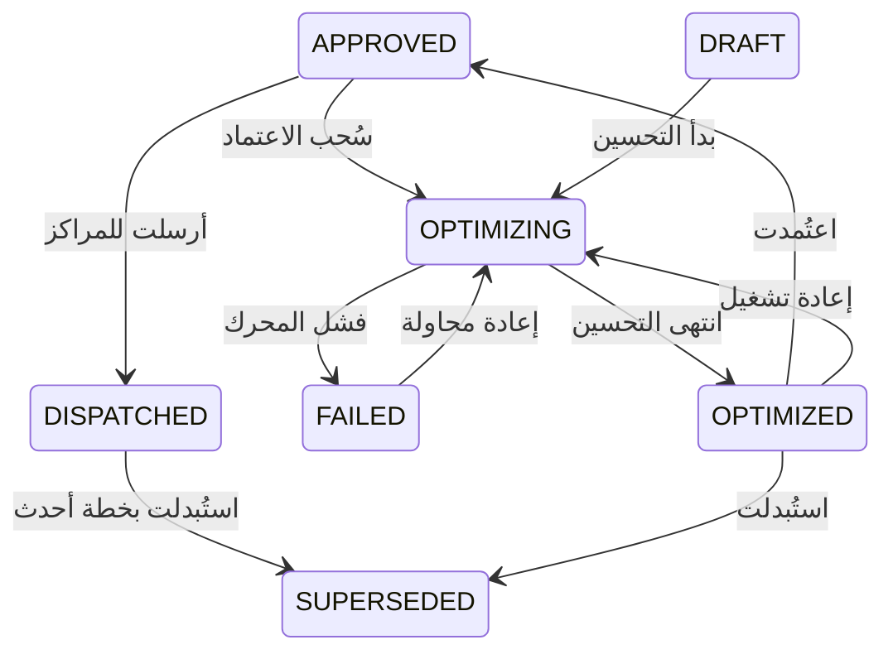

# ٤) آلات الحالة — الشحنة والرحلة والخطة

> **وثيقة مُولَّدة آليًا** من الشيفرة وقاعدة البيانات في 2026-08-26 21:32 UTC.
> لا تُحرَّر يدويًا: أعد توليدها بـ `PYTHONPATH=packages python3 scripts/gen_docs.py`.

الانتقالات ليست شرطًا في الكود فحسب: الجدول نفسه مُزامَن إلى
`allowed_transitions` في قاعدة البيانات، ومحفّزات `guard_*_transition`
ترفض أي تحديث حالة خارج الجدول. مصدر الحقيقة واحد
(`masar_core/state_machine.py`) والقاعدة تُلزم به.

## الشحنة

١٨ حالة. الخروج من `EXCEPTION` يتطلب سببًا مكتوبًا دائمًا، ولا تُحذف شحنة أبدًا (§19).

**47 انتقالًا**، منها **23** يتطلب سببًا مكتوبًا.

| من | إلى | الصلاحية | يتطلب سببًا | الوصف |
|---|---|---|---|---|
| `ARRIVED_DELIVERY` | `DELIVERED` | `routes.execute` | لا | تم التسليم |
| `ARRIVED_DELIVERY` | `EXCEPTION` | `exceptions.record` | لا | تعذر التسليم |
| `ARRIVED_PICKUP` | `CANCELLED_BEFORE_PICKUP` | `shipments.cancel` | نعم | أُلغيت عند الموقع قبل الالتقاط |
| `ARRIVED_PICKUP` | `EXCEPTION` | `exceptions.record` | لا | تعذر الالتقاط |
| `ARRIVED_PICKUP` | `PICKED_UP` | `routes.execute` | لا | تم الالتقاط |
| `ASSIGNED` | `CANCELLED_BEFORE_PICKUP` | `shipments.cancel` | نعم | أُلغيت قبل الالتقاط |
| `ASSIGNED` | `PENDING_ASSIGNMENT` | `routes.unassign` | نعم | أُزيل السائق |
| `ASSIGNED` | `PUBLISHED` | `routes.publish` | لا | نُشر لليوم |
| `DELIVERED` | `COMPLETED` | `routes.execute` | لا | اكتملت الشحنة |
| `DRAFT` | `PENDING_APPROVAL` | `ondemand.create` | لا | أُرسل للمراجعة |
| `DRAFT` | `REJECTED` | `schedule.commit` | نعم | استُبعد في التحقق |
| `DRAFT` | `VALIDATED` | `schedule.commit` | لا | اجتاز التحقق |
| `EXCEPTION` | `ARRIVED_DELIVERY` | `exceptions.resolve` | نعم | استُؤنف عند التسليم |
| `EXCEPTION` | `ARRIVED_PICKUP` | `exceptions.resolve` | نعم | استُؤنف عند الالتقاط |
| `EXCEPTION` | `CANCELLED_BEFORE_PICKUP` | `exceptions.resolve` | نعم | أُلغيت قبل الالتقاط |
| `EXCEPTION` | `COMPLETED` | `exceptions.resolve` | نعم | أُغلقت بعد حسم الاستثناء |
| `EXCEPTION` | `DELIVERED` | `exceptions.resolve` | نعم | سُلّمت بعد حسم الاستثناء |
| `EXCEPTION` | `FAILED` | `exceptions.resolve` | نعم | أُغلقت كفاشلة |
| `EXCEPTION` | `IN_PROGRESS` | `exceptions.resolve` | نعم | استُؤنف التنفيذ |
| `EXCEPTION` | `PENDING_ASSIGNMENT` | `exceptions.resolve` | نعم | أُعيدت الجدولة |
| `EXCEPTION` | `PICKED_UP` | `exceptions.resolve` | نعم | استُؤنف بعد الالتقاط |
| `IN_PROGRESS` | `ARRIVED_PICKUP` | `routes.execute` | لا | وصل لموقع الالتقاط |
| `IN_PROGRESS` | `CANCELLED_BEFORE_PICKUP` | `shipments.cancel` | نعم | أُلغيت قبل الالتقاط |
| `IN_PROGRESS` | `EXCEPTION` | `exceptions.record` | لا | حالة استثنائية |
| `PENDING_APPROVAL` | `CANCELLED_BEFORE_PICKUP` | `ondemand.cancel_own` | نعم | أُلغي قبل المراجعة |
| `PENDING_APPROVAL` | `PENDING_ASSIGNMENT` | `ondemand.review` | لا | اعتُمد الطلب |
| `PENDING_APPROVAL` | `REJECTED` | `ondemand.review` | نعم | رُفض الطلب |
| `PENDING_ASSIGNMENT` | `CANCELLED_BEFORE_PICKUP` | `shipments.cancel` | نعم | أُلغيت قبل الإسناد |
| `PENDING_ASSIGNMENT` | `PLANNED` | `plan.optimize` | لا | أُدرج في رحلة |
| `PENDING_ASSIGNMENT` | `UNPLANNABLE` | `plan.optimize` | لا | تعذر الإدراج |
| `PICKED_UP` | `ARRIVED_DELIVERY` | `routes.execute` | لا | وصل لموقع التسليم |
| `PICKED_UP` | `EXCEPTION` | `exceptions.record` | لا | حالة استثنائية |
| `PLANNED` | `ASSIGNED` | `routes.assign` | لا | أُسند لسائق |
| `PLANNED` | `CANCELLED_BEFORE_PICKUP` | `shipments.cancel` | نعم | أُلغيت قبل الالتقاط |
| `PLANNED` | `PENDING_ASSIGNMENT` | `routes.unassign` | نعم | أُعيد لقائمة الانتظار |
| `PLANNED` | `UNPLANNABLE` | `plan.optimize` | لا | خرج من الخطة بعد إعادة التشغيل |
| `PLANNED` | `VALIDATED` | `plan.optimize` | لا | أُعيد للتخطيط |
| `PUBLISHED` | `CANCELLED_BEFORE_PICKUP` | `shipments.cancel` | نعم | أُلغيت قبل الالتقاط |
| `PUBLISHED` | `EXCEPTION` | `exceptions.record` | لا | حالة استثنائية |
| `PUBLISHED` | `IN_PROGRESS` | `routes.execute` | لا | بدأت الرحلة |
| `PUBLISHED` | `PENDING_ASSIGNMENT` | `routes.unassign` | نعم | أُزيل السائق بعد النشر |
| `UNPLANNABLE` | `CANCELLED_BEFORE_PICKUP` | `shipments.cancel` | نعم | أُلغيت بعد تعذر التخطيط |
| `UNPLANNABLE` | `PLANNED` | `plan.optimize` | لا | أُعيد التخطيط بنجاح |
| `UNPLANNABLE` | `VALIDATED` | `plan.optimize` | لا | أُعيد للتخطيط |
| `VALIDATED` | `CANCELLED_BEFORE_PICKUP` | `shipments.cancel` | نعم | أُلغيت قبل التخطيط |
| `VALIDATED` | `PLANNED` | `plan.optimize` | لا | أُدرج في رحلة |
| `VALIDATED` | `UNPLANNABLE` | `plan.optimize` | لا | تعذر التخطيط |

## الرحلة

سحب النشر وإزالة السائق والإلغاء كلها تتطلب سببًا.

**11 انتقالًا**، منها **6** يتطلب سببًا مكتوبًا.

| من | إلى | الصلاحية | يتطلب سببًا | الوصف |
|---|---|---|---|---|
| `ASSIGNED` | `CANCELLED` | `routes.unassign` | نعم | أُلغيت |
| `ASSIGNED` | `PLANNED` | `routes.unassign` | نعم | أُزيل السائق |
| `ASSIGNED` | `PUBLISHED` | `routes.publish` | لا | نُشرت |
| `DRAFT` | `PLANNED` | `plan.optimize` | لا | اعتُمدت في الخطة |
| `IN_PROGRESS` | `CANCELLED` | `routes.unassign` | نعم | أُلغيت أثناء التنفيذ |
| `IN_PROGRESS` | `COMPLETED` | `routes.execute` | لا | اكتملت |
| `PLANNED` | `ASSIGNED` | `routes.assign` | لا | أُسندت لسائق |
| `PLANNED` | `CANCELLED` | `routes.unassign` | نعم | أُلغيت |
| `PUBLISHED` | `ASSIGNED` | `routes.unassign` | نعم | سُحب النشر |
| `PUBLISHED` | `CANCELLED` | `routes.unassign` | نعم | أُلغيت بعد النشر |
| `PUBLISHED` | `IN_PROGRESS` | `routes.execute` | لا | بدأ التنفيذ |

## الخطة

`FAILED` ليست نهاية الطريق — يمكن إعادة المحاولة.

**10 انتقالًا**، منها **0** يتطلب سببًا مكتوبًا.

| من | إلى | الصلاحية | يتطلب سببًا | الوصف |
|---|---|---|---|---|
| `APPROVED` | `DISPATCHED` | `plan.dispatch` | لا | أُرسلت للمراكز |
| `APPROVED` | `OPTIMIZING` | `plan.optimize` | لا | سُحب الاعتماد |
| `DISPATCHED` | `SUPERSEDED` | `plan.approve` | لا | استُبدلت بخطة أحدث |
| `DRAFT` | `OPTIMIZING` | `plan.optimize` | لا | بدأ التحسين |
| `FAILED` | `OPTIMIZING` | `plan.optimize` | لا | إعادة محاولة |
| `OPTIMIZED` | `APPROVED` | `plan.approve` | لا | اعتُمدت |
| `OPTIMIZED` | `OPTIMIZING` | `plan.optimize` | لا | إعادة تشغيل |
| `OPTIMIZED` | `SUPERSEDED` | `plan.optimize` | لا | استُبدلت |
| `OPTIMIZING` | `FAILED` | `plan.optimize` | لا | فشل المحرك |
| `OPTIMIZING` | `OPTIMIZED` | `plan.optimize` | لا | انتهى التحسين |

## قواعد عبر-كيانية

قواعد لا تعبّر عنها آلة حالة واحدة، وتُفحص في الخادم وفي القاعدة:

- **`assert_delivery_after_pickup`** — لا تسليم قبل التقاط، ولا زمن
  تسليم أسبق من زمن الالتقاط (قيد `CHECK` مرافق على `shipments`).
- **`assert_route_completable`** — لا تكتمل رحلة وفيها شحنة غير محسومة.
- **`assert_can_cancel_before_pickup`** — بعد الالتقاط لا يوجد «إلغاء
  قبل الالتقاط»، بل مسار استثناء.
- **`assert_route_startable`** — لا يبدأ السائق رحلة غير منشورة ولا
  قبل تاريخها.
