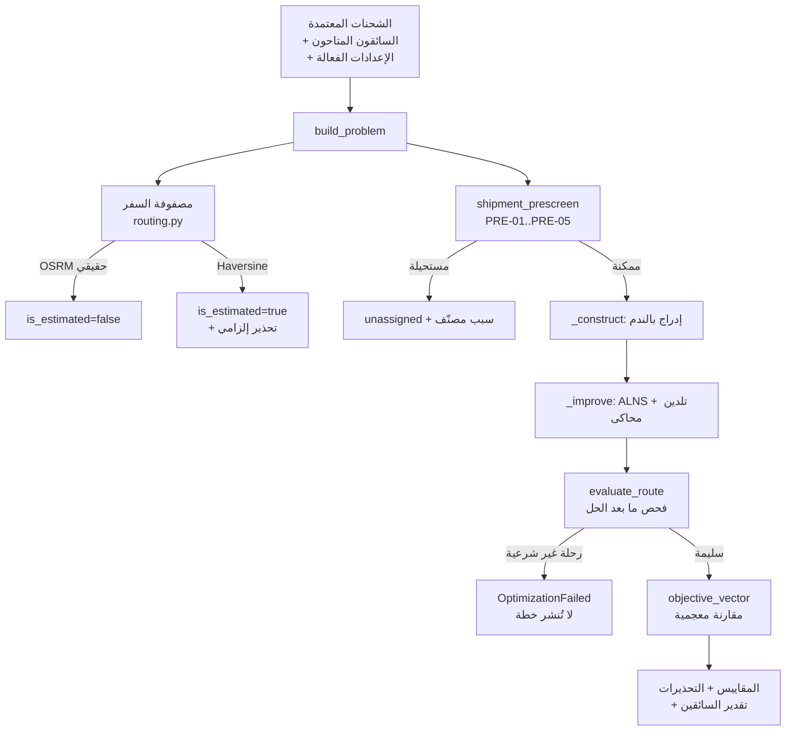

# ٧) معمارية محرك التخطيط والتحسين

## ١. توصيف المسألة

المسألة ليست «ترتيب نقاط على خريطة». توصيفها الدقيق:

> **Multi-Depot Pickup and Delivery Problem with Time Windows (MD-PDPTW)**
> بأهداف معجمية متعددة المستويات وقيود تجانس وقيود مسافة.

خصائصها في هذا النظام:

| الخاصية | الأثر على الحل |
|---|---|
| كل شحنة **زوج** التقاط/تسليم مرتبط | لا يكفي TSP/VRP؛ يلزم قيد أسبقية داخل الرحلة نفسها |
| نوافذ زمنية على الالتقاط + موعد نهائي على التسليم | البحث زمني لا مسافي فقط |
| عدة مراكز انطلاق | كل رحلة مقيّدة بمركزها؛ المسألة تتفكك جزئيًا لكن التقدير الوطني لا |
| قيد تجانس أصناف الجهات (HC-13) | يقطع فضاء الحلول بشكل غير محدَّب — لا يمكن تمثيله كتكلفة |
| حد رحلة بعيدة لكل سائق (HC-15) | قيد يوميّ عابر للرحلات، يُطبَّق في الإسناد لا في بناء الرحلة |
| إدراج فوري أثناء التنفيذ | يلزم محرك يعمل على حل قائم مع **بادئة مقفلة** لا من الصفر |

المسألة **NP-صعبة**. لا يوجد حل مضبوط عملي لأحجام وطنية، والاعتراف بذلك هو
أساس اختيار الطريقة.

## ٢. لماذا هذه الطريقة (§10 يطلب التبرير)

| حجم المسألة | الطريقة | لماذا |
|---|---|---|
| ≤ ٩ عقد في رحلة واحدة | **بحث مضبوط** (`exact.py`) — تعداد مع تشذيب Branch & Bound | يعطي الأمثل المؤكد، ويُستخدم **مرجعًا لقياس جودة الاستدلال** في الاختبارات لا في الإنتاج |
| مئات إلى آلاف الشحنات | **إدراج بالندم (Regret-k) ثم ALNS** (`solver.py`) | معيار صناعي مثبت لـ PDPTW (Ropke & Pisinger 2006): جودة قريبة من الأمثل ضمن مهلة محددة، ويدعم الإدراج الديناميكي بنفس الشيفرة |

**لماذا ليس نموذجًا لغويًا؟** (§10 يمنعه صراحةً) — ترتيب المسار هنا ناتج عن
نموذج رياضي: كل حل يُبنى من مصفوفة أزمنة عددية، ويمر على `evaluate_route`
الذي يفحص القيود الصلبة حسابيًا. كل قرار **قابل للتفسير والتكرار**: البذرة
العشوائية ثابتة، وتشغيل نفس المدخلات يعطي نفس المخرجات.

## ٣. البنية



### الملفات

| الملف | المسؤولية |
|---|---|
| `model.py` | نموذج المسألة — مستقل تمامًا عن قاعدة البيانات والواجهة. الزمن **دقائق مطلقة** لتفادي التباس المناطق الزمنية داخل المحرك |
| `routing.py` | مزوّدو المسافات خلف واجهة واحدة: `OSRMProvider` (حقيقي)، `MatrixFileProvider` (مصفوفة محفوظة)، `HaversineProvider` (تقديري **معلن**)، `FailingProvider` (لاختبار الفشل) |
| `evaluate.py` | **المرجع الوحيد لشرعية أي رحلة في النظام** |
| `solver.py` | البناء بالندم + ALNS |
| `objective.py` | متجه الأهداف والمقارنة المعجمية |
| `estimation.py` | تقدير عدد السائقين مع تبرير لكل سائق |
| `exact.py` | الحل المضبوط المرجعي |
| `dynamic.py` | الإدراج الديناميكي للطلبات الفورية |
| `engine.py` | التنسيق: بناء المسألة، تشغيل الخلفية، إخراج خطة قابلة للتفسير |
| `backends.py` | واجهة تركيب حلّال بديل (OR-Tools) |

## ٤. `evaluate.py` — نقطة الحقيقة الواحدة

كل رحلة في النظام تمر بهذه الدالة، بلا استثناء:

- **أثناء البحث** — لتقييم كل موضع إدراج مرشّح.
- **بعد الحل** — `run_engine` يعيد فحص كل رحلة أنتجها الحلّال، وإن كانت
  تخرق قيدًا صلبًا يرفع `OptimizationFailed` بدل أن يعيدها. أي خلفية حلّ
  جديدة، مهما كان مصدرها، تخضع لنفس الفحص.
- **قبل النشر** — محفّز `guard_route_publish` في قاعدة البيانات يستدعي
  `app.verify_route_feasibility()` قبل السماح بالنشر.
- **في الاختبارات** — تُستدعى مباشرةً بتسلسلات مصنوعة يدويًا لإثبات كل قيد.

### القيود الصلبة المُنفَّذة فيها

| الرمز | القيد | ما الذي يمنعه فعليًا |
|---|---|---|
| HC-01 | الأسبقية والاكتمال | تسليم قبل التقاطه؛ رحلة تحمل طرفًا واحدًا من شحنة |
| HC-02 | نافذة الالتقاط | وصول بعد نهاية النافذة (والوصول المبكر يصير انتظارًا يُحتسب) |
| HC-03 | الموعد النهائي للتسليم | اكتمال التسليم بعد SLA |
| HC-05 | مدة الوردية وأوقات العمل | تجاوز حد الوردية أو انتهاء الرحلة بعد إغلاق المركز |
| HC-11 | التقاطان من الجهة نفسها | تنفيذ الالتقاط الثاني قبل تسليم الأول — **القيد مُولَّد من البيانات آليًا** |
| HC-13 | تجانس أصناف جهات الالتقاط | جمع مستشفى ومركز صحي على السائق نفسه (بنك الدم معفى بالإعداد) |
| HC-16 | ما بعد الرحلة البعيدة | إضافة **التقاط** قريب من المركز بعد قطع مسافة بعيدة |

**ملاحظة على HC-16:** يُطبَّق على محطات الالتقاط فقط. تسليم ما جُمِع فعلًا
يكون في المدينة حيث المختبر، وهو المقصد الحتمي للرحلة؛ اعتباره «تنقل مدينة»
كان يجعل كل رحلة بعيدة مستحيلة — وهو خطأ كشفه اختبار السيناريو ١٣.

### الفحص المبدئي (`shipment_prescreen`)

قبل أي بحث، تُفحص كل شحنة **منفردة** بافتراض رحلة مخصصة لها وحدها:

| الرمز | يكشف |
|---|---|
| PRE-01 | بيانات ناقصة أو إحداثيات غير صالحة |
| PRE-02 | نافذة التقاط لا يمكن بلوغها من أي مركز انطلاق |
| PRE-03 | SLA لا يمكن بلوغه حتى برحلة مخصصة |
| PRE-04 | تنفيذها منفردة يتجاوز حد الوردية |
| PRE-05 | SLA قبل بداية نافذة الالتقاط (تناقض في المدخلات) |

الفائدة مزدوجة: تشذيب فضاء البحث، و**سبب دقيق** بدل «تعذر الإدراج» الغامض.

## ٥. متجه الأهداف — مقارنة معجمية لا وزنية

`objective_vector` يعيد ثمانية مستويات مرتّبة:

```
(الشحنات غير المخططة, عدد السائقين, زمن القيادة, المسافة,
 التكلفة, زمن الانتظار, عدم العدالة, الانحراف عن الأساس)
```

المقارنة **معجمية**: المستوى الأدنى رقمًا يحسم أولًا، ولا يُقايَض بأي تحسّن
في مستوى أدنى أهمية. تقليل سائق واحد لا يُشترى بشحنة غير مخططة، مهما كان
الوفر. `STRICT_LEVELS = 2` يعني أن أول مستويين لا يقبلان أي تدهور إطلاقًا.

الجمع الوزني (`soft_scalar`) يُستخدم **فقط** داخل التلدين المحاكى لقبول
حلول وسيطة أسوأ مؤقتًا في المستويات المرنة — ولا يُستخدم أبدًا للمقارنة
النهائية بين حلّين.

## ٦. الأداء وحدوده

قياس فعلي على هذه البيئة (Python نقي، بلا مكتبات مترجمة، مركز واحد، مهلة
١٥ ثانية):

| الشحنات | زمن الحل | الرحلات | المخطط |
|---|---|---|---|
| ٤٠ | ~١٥ ث | ٦ | ٤٠/٤٠ |
| ٨٠ | ~١٧ ث | ١٠ | ٨٠/٨٠ |
| ٣٠٠ | ~٢٧ ث | ٣٠ | ٣٠٠/٣٠٠ |

ثلاثة قرارات هندسية جعلت هذا ممكنًا، وكلها كشفها **قياس** لا حدس:

1. **ذاكرة مؤقتة لمواضع الإدراج.** إعادة حساب كل المرشحين لكل شحنة في كل
   جولة كانت من الدرجة `O(S² × V × L²)`؛ بعد إدراج شحنة لا تتغير إلا
   الرحلة المعدَّلة. قبل التحسين: ٨٠ شحنة في **٣١٦ ثانية**.
2. **ترشيح هندسي لمواضع الإدراج** (`max_positions_per_route`، افتراضيًا ١٢).
   حدّ أدنى رخيص مبني على زيادة المسافة يرتّب الأزواج، ثم يُقيَّم أفضلها
   تقييمًا كاملًا. الترشيح **لا يمكنه قبول رحلة غير شرعية** — أقصى ما قد
   يفعله تفويت موضع أرخص، وهو ثمن معلن قابل للضبط.
3. **ممثّل واحد للمركبات الفارغة المتطابقة.** توليد مرشح لكل سائق احتياطي
   يضاعف الزمن بعدد السائقين بلا فائدة.

**حارس المهلة:** عند تجاوز المهلة يكمل البناء بإدراج «أول ما يصلح» — أضعف
جودةً وأسرع كثيرًا، ولا يخلّ بالشرعية لأن كل مرشح يمر على `evaluate_route`.
خطة لا تصل في وقتها التشغيلي فشل أشد من خطة أقل تحسينًا.

**الحدود المعروفة:** الأرقام أعلاه لمركز واحد. الخطة الوطنية تتفكك إلى
مسألة لكل (مركز × يوم)، وهي قابلة للتوازي — لكن التوازي **لم يُنفَّذ ولم
يُختبر** بعد. لأحجام أكبر، الطريق المعلن هو تركيب خلفية OR-Tools عبر
`SolverBackend` دون تغيير أي متصل.

## ٧. تركيب OR-Tools

`backends.py` يعرّف `SolverBackend` كواجهة. الخلفية الفعالة والمختبَرة هي
`native_alns`. خلفية `ortools` **مُصرَّح بعدم توفرها** وترفع
`DependencyUnavailable` برسالة تشرح خطوات التفعيل، بدل أن تدّعي عملًا لم
يُختبر (§34).

للتفعيل في بيئة الإنتاج:

1. `pip install ortools`
2. `MASAR_OPTIMIZER_BACKEND=ortools`
3. تنفيذ `solve` ببناء `RoutingIndexManager` مع بُعدَي الزمن والمسافة،
   وقيود `AddPickupAndDelivery` و`CumulVar` للنوافذ، ثم تحويل الناتج إلى
   `Solution`.

الخلفية الجديدة تمر على نفس `evaluate_route` قبل القبول، فلا يمكنها إدخال
رحلة غير شرعية مهما كان مصدرها.

## ٨. نسبة التحسين — لا رقم بلا أساس

§34 يمنع عرض نسبة تحسين دون خطة أساس. التنفيذ:

- `_reference_plan` يبني **خطة أساس جشعة** (إدراج أول-ما-يصلح، بلا ندم وبلا
  تحسين) تقارب ما يفعله مخطط بشري يوزّع بالترتيب.
- كل نسبة تُعرض مصحوبة بـ `baseline_kind` و`baseline_label_ar` وبالقيمة
  الأساس نفسها إلى جانب القيمة المحسّنة.
- إن تعذّر بناء الأساس، `baseline_kind = "NONE"` و**لا تُعرض نسبة إطلاقًا**.

## ٩. تقدير عدد السائقين — رقم بتبرير

`estimation.py` لا يعطي رقمًا مجردًا. يبني ثلاثة حدود دنيا نظرية (حجم العمل
÷ الوردية، أثر قيد عدم الخلط، تعارضات النوافذ الزمنية)، ثم يضيف احتياطي
الطلبات الفورية، ويخرج **قائمة تبريرات** كل عنصر فيها يقول: كم سائقًا،
ولماذا، وبأي حساب.

`_sla_impact` يذهب أبعد: يعيد الحل فعليًا بسائق أقل وبسائقين أقل، ويقيس كم
شحنة تصبح غير قابلة للتخطيط — فيتحول سؤال «هل نحتاج هذا السائق؟» من رأي
إلى رقم مقيس.
